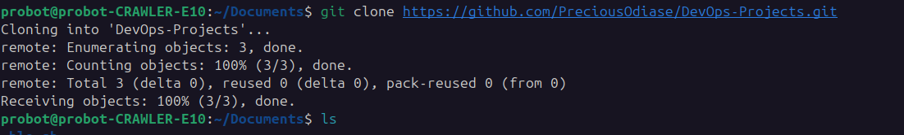
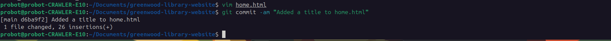
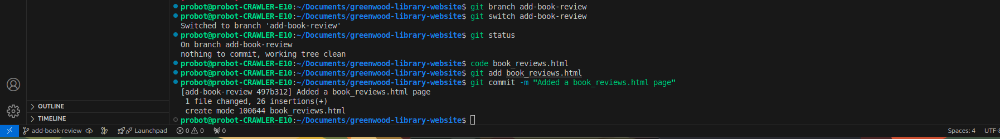
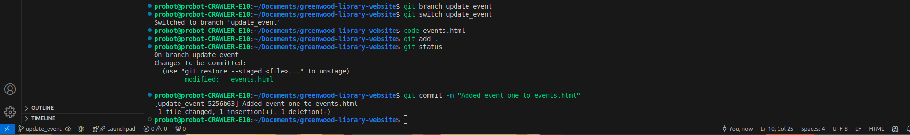
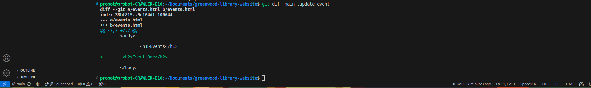
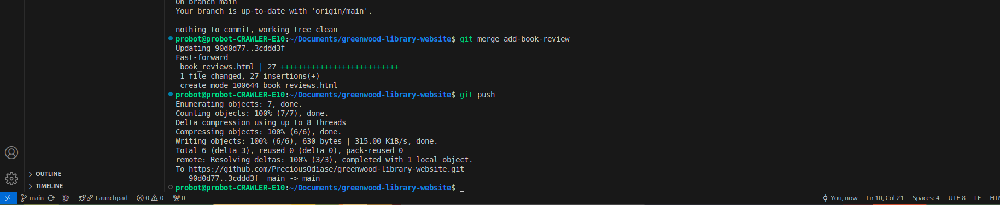
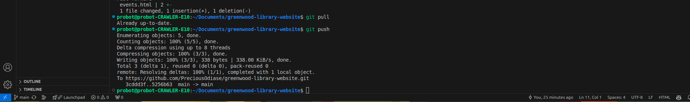
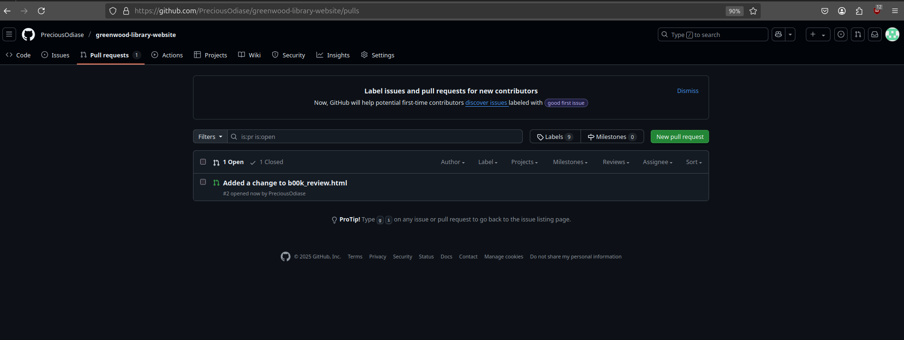

# GreenWood Library Project
In this project i will be using git and github to collaborate on a project. The project is a website for Greenwood library. In this project, version control will be demostrated using git and github.

# Creating the Repository and neccessary files

# Adding the files to the staging area

# Creating another branch

# Made changes to the branch 

# Checked the difference between the branch and main

# Merged the branch into main

# Saving the project on a remote repository

# Git Pull Request

