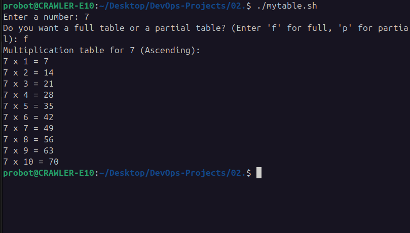
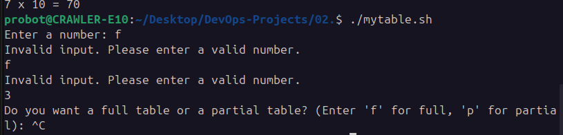
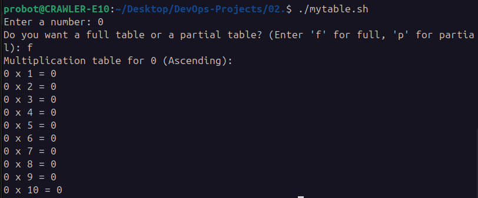
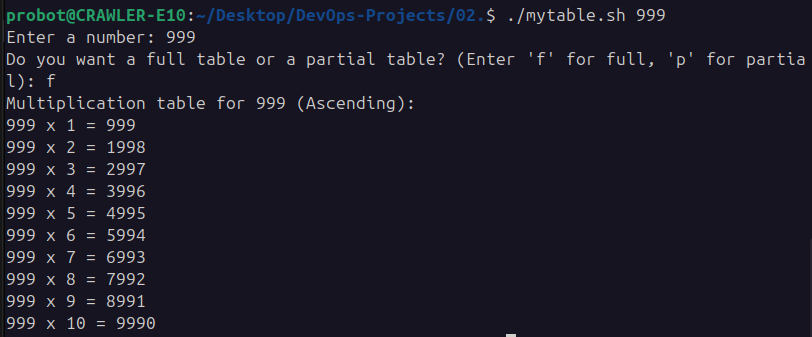

# Multiplication Table Generator - Bash Script

This project is a Bash script that generates a multiplication table. It demonstrates basic scripting, input handling, and output formatting. In this README, we will explain the script’s functionality, the tests performed, and how to use it.

## Table of Contents
1. [Overview](#overview)
2. [Usage](#usage)
3. [Features](#features)
4. [Tests](#tests)


## Overview

The script is designed to generate a multiplication table for a given number and display it in a clean, easy-to-read format. It allows the user to input a number, and it will output the multiplication table up to 10x.

### Script Functionality
- **Input**: The script prompts the user to input a number for which the multiplication table will be generated.
- **Output**: The multiplication table is displayed in a neat tabular format.
- **Error Handling**: If the user inputs a non-numeric value, the script will prompt the user again until a valid input is received.

## Usage

### Prerequisites

- A Unix-like environment with Bash installed (Linux, macOS, WSL, etc.)
- Ensure the script file is executable by running:

    ```bash
    chmod  u+x mytable.sh
    ```

### Running the Script

To run the script, use the following command:

```bash
./mytable.sh
```

The script will prompt you to input a number. Once you provide the number, the multiplication table will be printed to the console.


### Example Output

```bash
Enter a number for the multiplication table: 5
Multiplication Table for 5:
5 x 1 = 5
5 x 2 = 10
5 x 3 = 15
5 x 4 = 20
5 x 5 = 25
5 x 6 = 30
5 x 7 = 35
5 x 8 = 40
5 x 9 = 45
5 x 10 = 50

```


## Tests

The following tests were conducted to ensure the script functions correctly:

1. **Test 1: Valid Input**
    - **Input**: `7`
    - **Expected Output**: Multiplication table for 7 (from 7 x 1 to 7 x 10).
    
      <!-- Placeholder for valid input test image -->

2. **Test 2: Non-Numeric Input**
    - **Input**: `abc`
    - **Expected Output**: Error message prompting the user to enter a valid number.
    
      <!-- Placeholder for non-numeric input test image -->

3. **Test 3: Edge Case - Zero**
    - **Input**: `0`
    - **Expected Output**: The multiplication table for 0 (all results should be 0).
    
      <!-- Placeholder for edge case zero image -->

4. **Test 4: Large Input**
    - **Input**: `999`
    - **Expected Output**: Multiplication table for 999.
    
      <!-- Placeholder for large input test image -->


