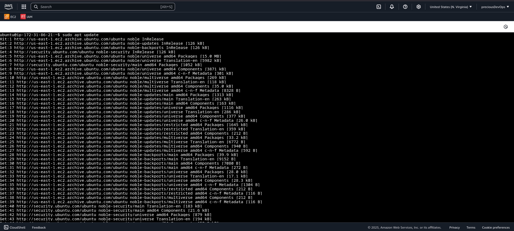
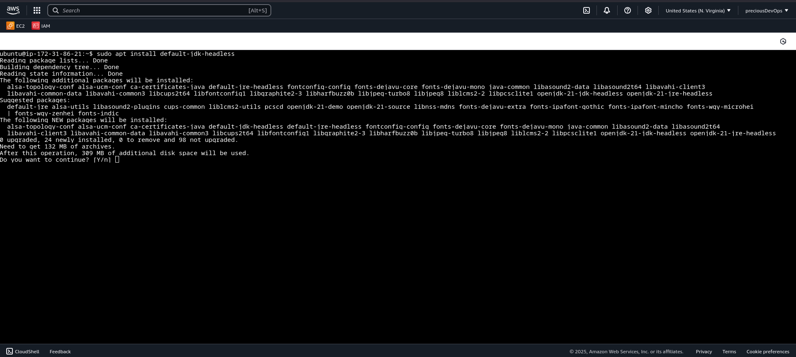
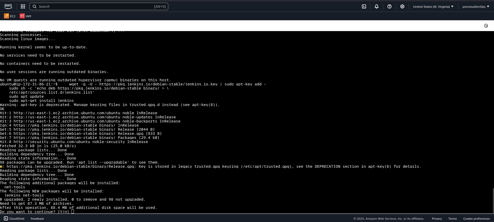
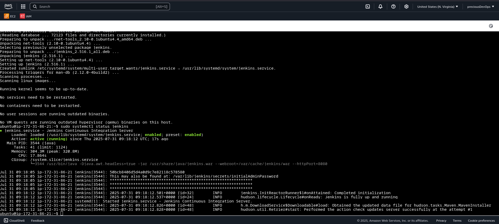
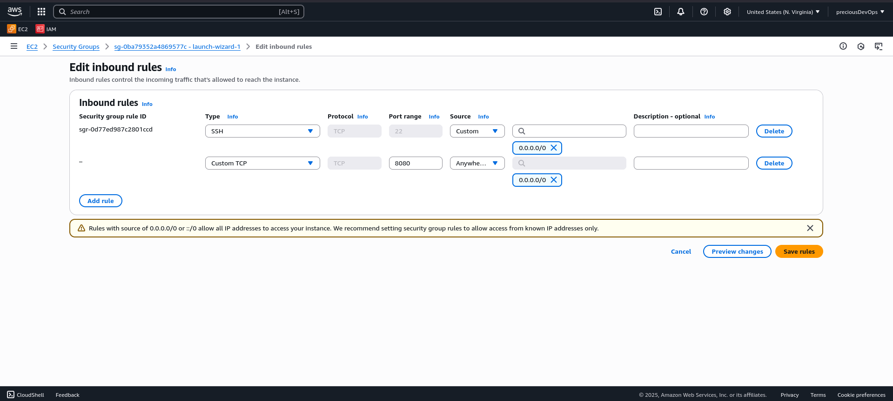
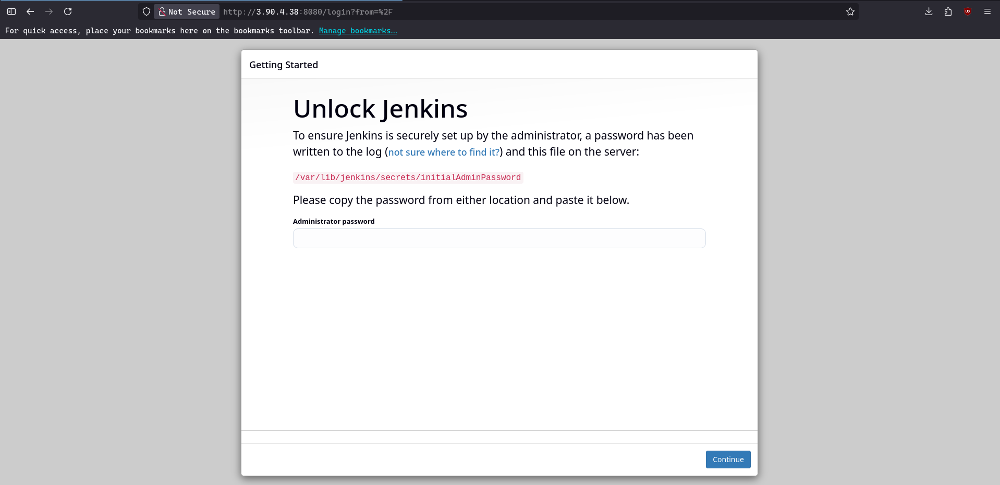
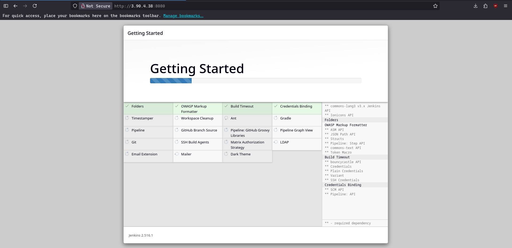
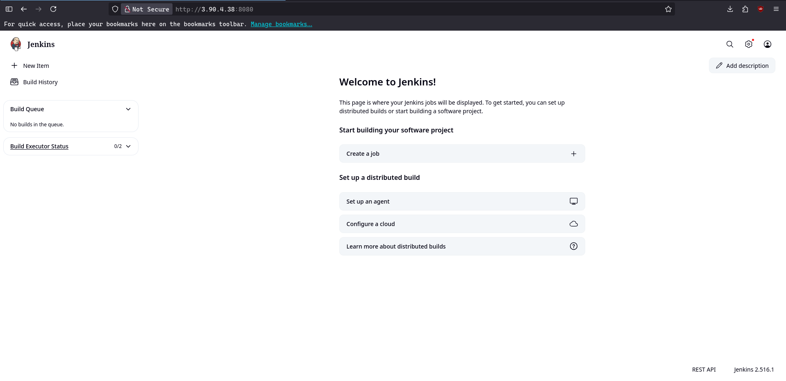
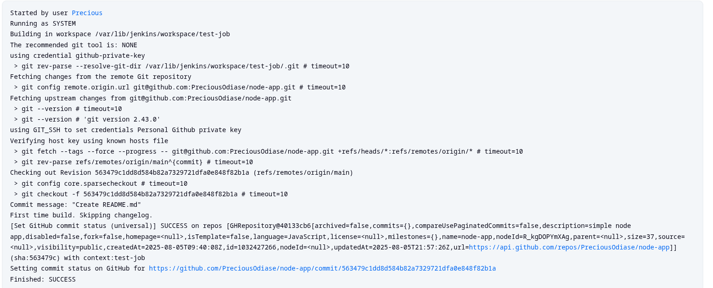

# **Jenkins Installation and Setup**

This projects showcases the setup of Jenkins on an AWS EC2 instance and running my first pipeline.

### Setup

1. Launch and EC2 Instance and SSH into the the instance. Then run the following commands to install Java and Jenkins.

```bash
# Install Java
sudo apt update
sudo apt install fontconfig openjdk-21-jre

# Confirm Java installation
java -version

# Jenkins Installation
sudo wget -O /etc/apt/keyrings/jenkins-keyring.asc \
  https://pkg.jenkins.io/debian-stable/jenkins.io-2023.key
echo "deb [signed-by=/etc/apt/keyrings/jenkins-keyring.asc]" \
  https://pkg.jenkins.io/debian-stable binary/ | sudo tee \
  /etc/apt/sources.list.d/jenkins.list > /dev/null
sudo apt-get update
sudo apt-get install jenkins

```

### Update Package repositories

- 

### Install JDK

- 

### Install Jenkins

- 

2. Next we start Jenkins and enable the Jenkins service to start at boot.

```bash
# Start Jenkins service
sudo systemctl enable jenkins

# Enable Jenkins service to start at boot
sudo systemctl start jenkins

# Check the status of the Jenkins service
sudo systemctl status jenkins

```

- 

3. Return to AWS console and configure the security group of the EC2 instance to allow traffic on port 8080.

### Add inbound rule to allow port 80

- 

4. Login into the ip on port 8080
   From AWS EC2 console, copy the public IP address of the instance then append ":8080"

- 

5. To Login to the Jenkins, run the following command to access the admin password

```bash
sudo cat /var/lib/jenkins/secrets/initialAdminPassword
```

6. Select the install suggested plugin option, after installation create a user account

### Install plugins

- 

### Login to Jenkins console

- 

## Jenkins Setup

1.  Access Manage Jenkins. On the System page.
2.  Add a Github server with these parameters

- Name = Github
- API URL = https://api.github.com
- Credential = Create a Github personal token and paste it here.

3. SSH into the Jenins EC2 then run the following commands

```bash
# Switch to the Jenkins user
sudo su - jenkins

# Create SSH key pair
ssh-keygen

```

Add the public SSH key to Github account
Add the private key to Jenkins credentials

### Freestyle Job

Create a freestyle Job in jenkins

- 

## Pipeline job

- [image]()
