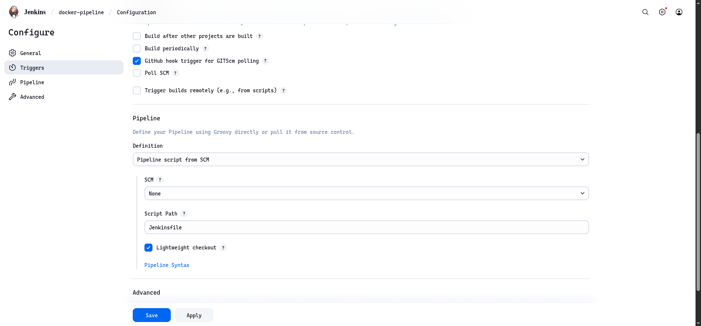
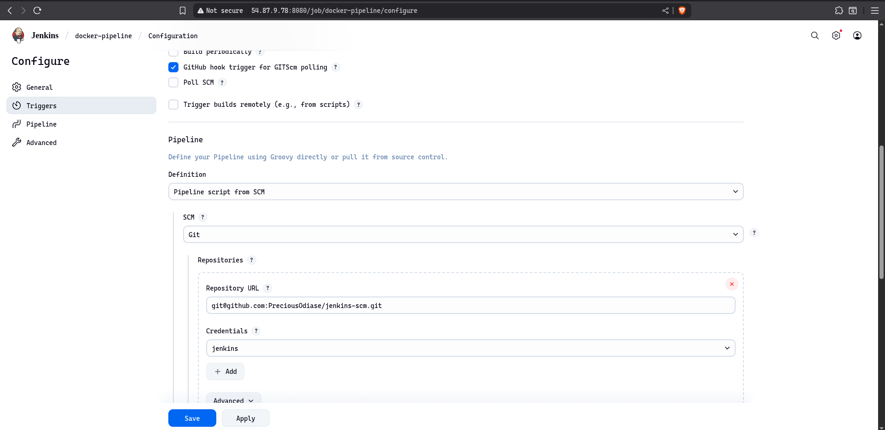
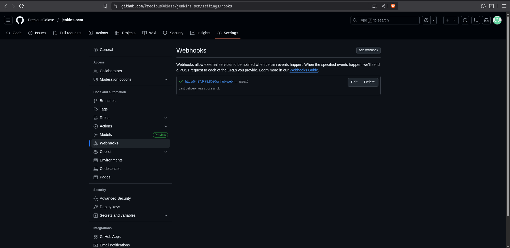
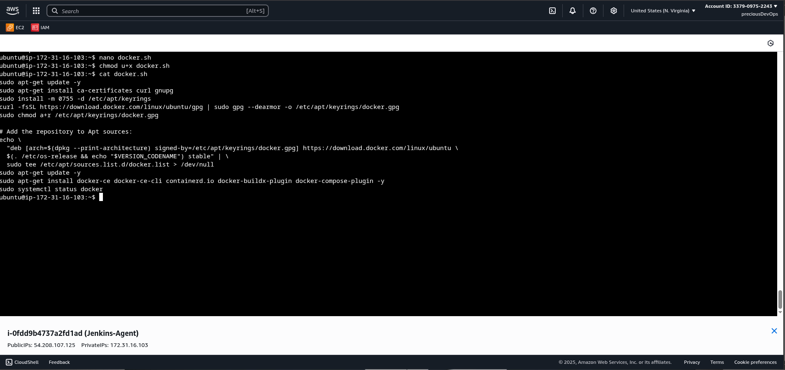
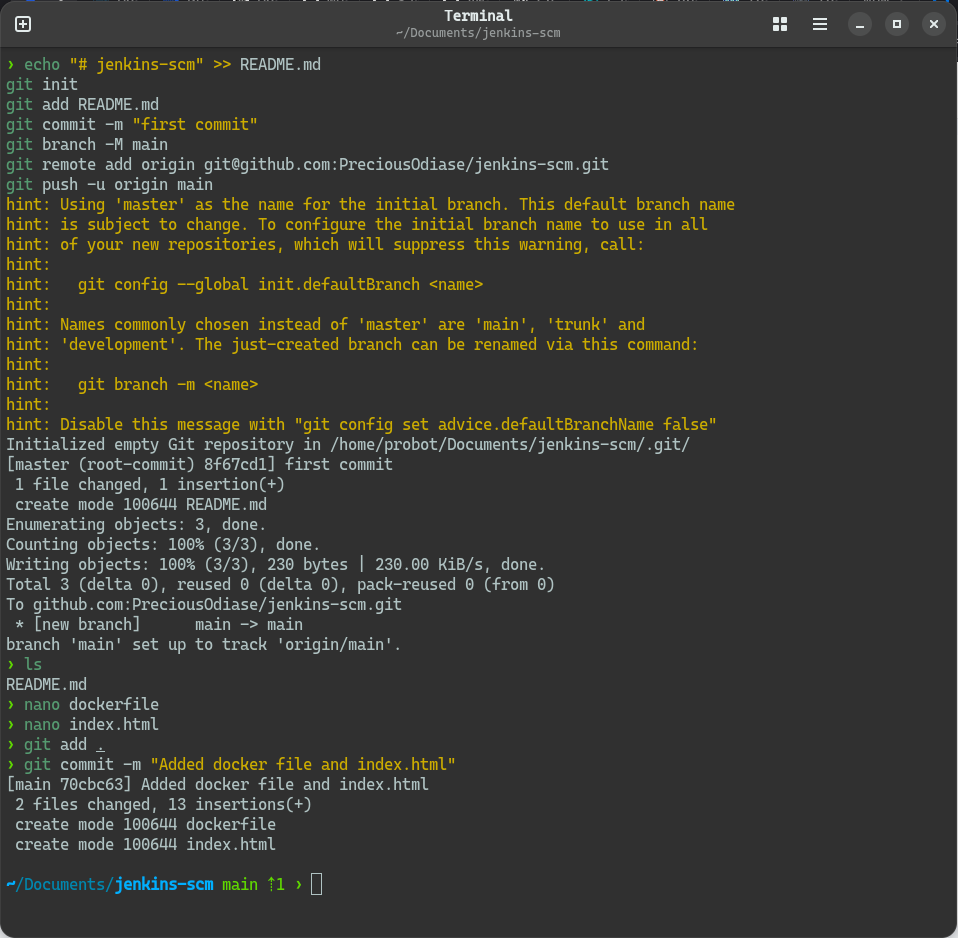
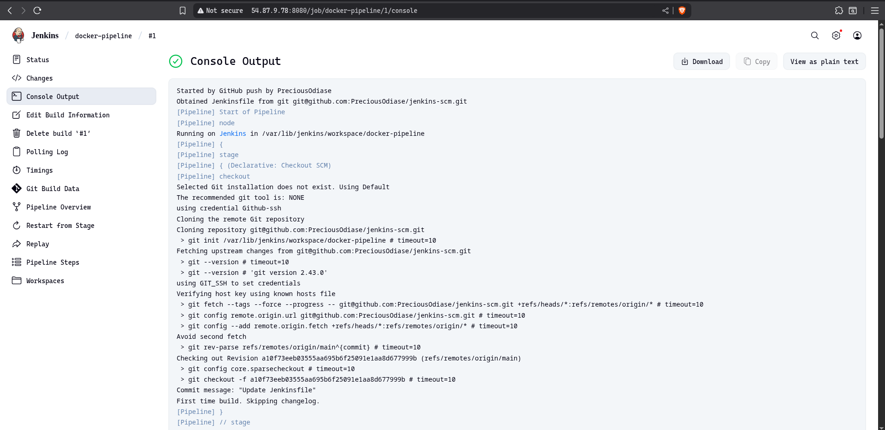
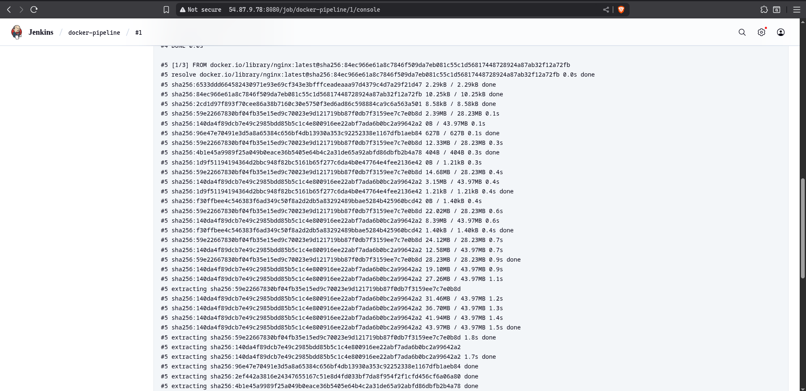
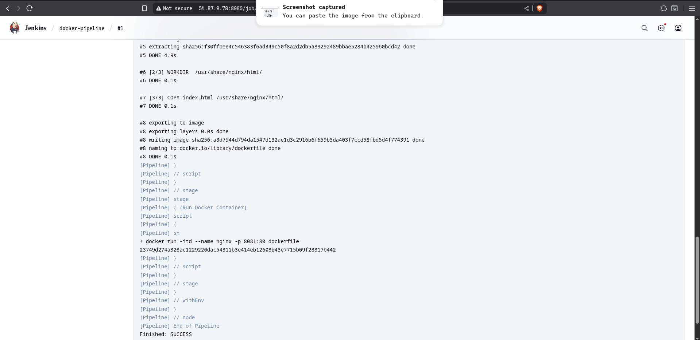
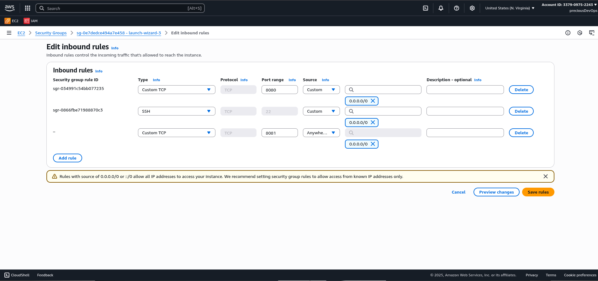
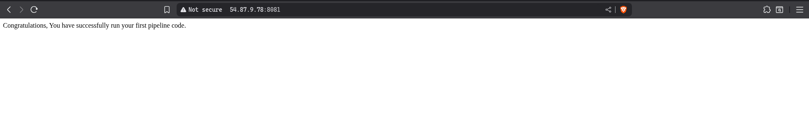

# Jenkins Pipeline Project Showcase

This guide demonstrates how to set up and manage a **Jenkins Pipeline Project**. We'll walk through creating a pipeline job, configuring triggers, writing the pipeline script, installing Docker, and finally building the project using the pipeline.

---

## Creating a Pipeline Job

1. Open the **Jenkins dashboard**.
2. Click **New Item**.
3. Enter a name for your job (e.g., `my-pipeline-project`).
4. Select **Pipeline** and click **OK**.
5. In the configuration screen, provide a short **description** (optional).



---

## Configuring Build Triggers

To automate your pipeline:

1. Scroll to the **Build Triggers** section.
2. Check the option **GitHub hook trigger for GITScm polling** if using GitHub.
3. Select pipeline script from SCM



---

## Writing Jenkins Pipeline Script

Write your pipeline using the **Declarative Pipeline Syntax** directly in the Jenkins UI and reference the `Jenkinsfile` from your repository.

**Example Script:**

```groovy
pipeline {
    agent any

    stages {
        stage('Build Docker Image') {
            steps {
                script {
                    sh 'docker build -t dockerfile .'
                }
            }
        }

        stage('Run Docker Container') {
            steps {
                script {
                    sh 'docker run -itd --name nginx -p 8081:80 dockerfile'
                }
            }
        }
    }
}
```

# Configure Webhook

Enter the setting on the github repository and configure webhook



## Installing Docker

To build Docker images or run containers in your pipeline:

Install Docker on your Jenkins server:

```bash
sudo apt-get update -y
sudo apt-get install ca-certificates curl gnupg
sudo install -m 0755 -d /etc/apt/keyrings
curl -fsSL https://download.docker.com/linux/ubuntu/gpg | sudo gpg --dearmor -o /etc/apt/keyrings/docker.gpg
sudo chmod a+r /etc/apt/keyrings/docker.gpg

# Add the repository to Apt sources:
echo \
  "deb [arch=$(dpkg --print-architecture) signed-by=/etc/apt/keyrings/docker.gpg] https://download.docker.com/linux/ubuntu \
  $(. /etc/os-release && echo "$VERSION_CODENAME") stable" | \
sudo tee /etc/apt/sources.list.d/docker.list > /dev/null
sudo apt-get update -y
sudo apt-get install docker-ce docker-ce-cli containerd.io docker-buildx-plugin docker-compose-plugin -y
sudo systemctl status docker
```

```bash
# Verify Docker access in Jenkins:
docker version

# Add Jenkins user to Docker
sudo usermod -aG docker jenkins
```

Install Docker Pipeline Plugin in Jenkins (Manage Jenkins > Manage Plugins > Available).



## Dockerfile

```bash
# Use the official NGINX base image
FROM nginx:latest

# Set the working directory in the container
WORKDIR  /usr/share/nginx/html/

# Copy the local HTML file to the NGINX default public directory
COPY index.html /usr/share/nginx/html/

# Expose port 80 to allow external access
EXPOSE 80
```

---



## Jenkins job triggered





## Final Steps

Ensure port 8081 is open/exposed on your cloud instance or server. jenkins

Access your deployed index.html page by visiting http://:8081 in your browser.


## Summary

Set up a Jenkins Pipeline job connected to GitHub.

Generated and inserted a valid pipeline script.

Installed Docker using a shell script.

Triggered a Jenkins build by pushing files to GitHub.

Exposed a custom web app through port 8081.
