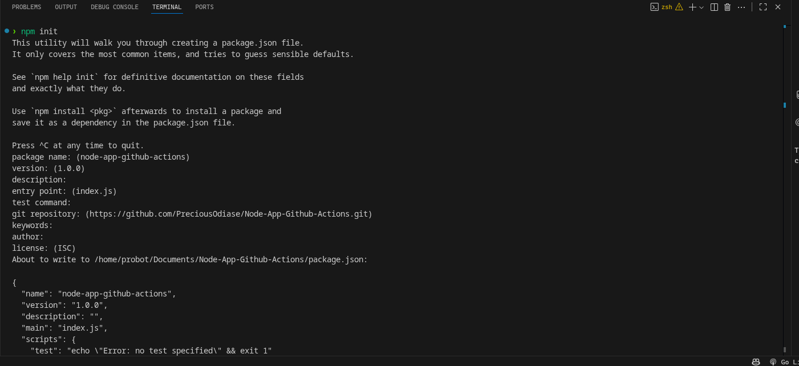
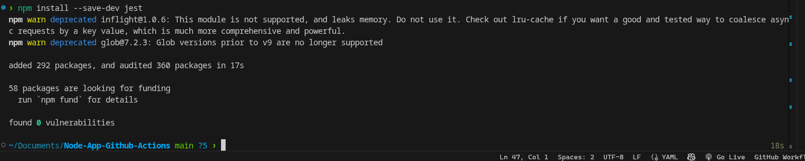
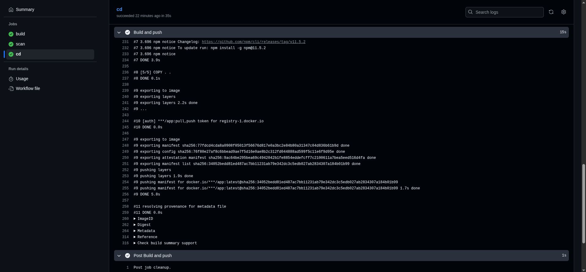

# Node-App-Github-Actions

This document outlines the steps taken to set up a Node.js project with Express, Jest testing, linting, Gitleaks secret scanning, and GitHub Actions CI/CD including Docker Hub deployment.

---

## 1. Initialize Node.js Project

- Run `npm init` to create `package.json`.

```bash
npm init -y
Result: package.json file created.
```




---

## 2. Install Dependencies

Installed Express for server functionality:

```bash
npm install express
```

Installed Jest for testing:

```bash
npm install jest --save-dev
```

Installed ESLint for linting:

```bash
npm install eslint --save-dev
```

Result: package-lock.json created and dependencies listed in package.json.




---

## 3. Project Structure

```
Node-App-Github-Actions/
│
├─ index.js          # Express server
├─ package.json
├─ package-lock.json
├─ __tests__/
│   └─ app.test.js   # Jest test file
├─ .github/
│   └─ workflows/
│       └─ node.js.yml  # GitHub Actions workflow
├─ Dockerfile        # Docker build file
└─ .eslintrc.json    # ESLint config
```

---

## 4. Express Server Setup

index.js

```javascript
const express = require("express");
const app = express();
const port = process.env.PORT || 3000;

app.get("/", (req, res) => {
  res.send("Hello World!");
});

if (require.main === module) {
  app.listen(port, () => {
    console.log(`App listening at http://localhost:${port}`);
  });
}

module.exports = app;
```

Verified locally:

```bash
npm start
```

---

## 5. Jest Testing

**tests**/app.test.js

```javascript
const request = require("supertest");
const app = require("../index");

describe("GET /", () => {
  it("should return Hello World!", async () => {
    const res = await request(app).get("/");
    expect(res.text).toBe("Hello World!");
    expect(res.statusCode).toBe(200);
  });
});
```

Run tests:

```bash
npm test
```


---

## 6. ESLint Linting

Initialize ESLint:

```bash
npx eslint --init
```

Run lint:

```bash
npm run lint
```

---

## 7. Gitleaks Secret Scanning

Gitleaks scans for secrets in your codebase.

Add Gitleaks to your workflow:

```yaml
- name: Run Gitleaks
  uses: gitleaks/gitleaks-action@v2
  with:
    config-path: .github/gitleaks.toml
```


---

## 8. Docker Hub Deployment

Add a Dockerfile:

```dockerfile
# Dockerfile
FROM node:18-alpine
WORKDIR /app
COPY package*.json ./
RUN npm ci --only=production
COPY . .
EXPOSE 3000
CMD ["node", "index.js"]
```

Push to Docker Hub in workflow:

```yaml
- name: Build Docker image
  run: docker build -t ${{ secrets.DOCKER_USERNAME }}/node-app:${{ github.sha }} .

- name: Login to Docker Hub
  uses: docker/login-action@v3
  with:
    username: ${{ secrets.DOCKER_USERNAME }}
    password: ${{ secrets.DOCKER_PASSWORD }}

- name: Push Docker image
  run: docker push ${{ secrets.DOCKER_USERNAME }}/node-app:${{ github.sha }}
```



---

## 9. GitHub Actions Workflow

.github/workflows/node.js.yml

```yaml
name: Node.js CICD

on:
  push:
    branches: ["main"]
  pull_request:
    branches: ["main"]

jobs:
  build:
    runs-on: ubuntu-latest

    steps:
      - name: Checkout-code
        uses: actions/checkout@v4

      - name: Setup Node.js
        uses: actions/setup-node@v4
        with:
          node-version: "18.x"
          cache: "npm"
      - run: |
          npm ci
          npm run build --if-present
          npm test
          npm run lint

  scan:
    runs-on: ubuntu-latest
    needs: build

    steps:
      - name: Checkout-code
        uses: actions/checkout@v4
        with:
          fetch-depth: 0
      - uses: gitleaks/gitleaks-action@v2

  cd:
    runs-on: ubuntu-latest
    needs: scan
    steps:
      - name: Login to Docker Hub
        uses: docker/login-action@v3
        with:
          username: ${{ secrets.DOCKERHUB_USERNAME }}
          password: ${{ secrets.DOCKERHUB_TOKEN }}
      - name: Set up QEMU
        uses: docker/setup-qemu-action@v3
      - name: Set up Docker Buildx
        uses: docker/setup-buildx-action@v3
      - name: Build and push
        uses: docker/build-push-action@v6
        with:
          push: true
          tags: ${{ secrets.DOCKERHUB_USERNAME }}/app:latests
```


---

## 10. Notes

- `package-lock.json` ensures reproducible installs for CI/CD.
- Node 18+ is required to run Jest 30 due to `os.availableParallelism()`.
- `.gitignore` should include:

```bash
node_modules/
.env
```

---

### Workflow Features

- **Testing with Jest**: Runs unit tests for every push and pull request.
- **Linting with ESLint**: Ensures code quality.
- **Secret Scanning with Gitleaks**: Prevents secrets from leaking.
- **Docker Build & Push**: Builds and pushes image to Docker Hub.
- **Ignored Triggers**: Changes to `README.md` do not trigger CI.

1. On each push or PR to `main` (except `README.md` changes), GitHub Actions runs:
   - **Install**: `npm ci` with caching
   - **Lint**: `npm run lint`
   - **Test**: `npm test`
   - **Build**: `npm run build --if-present`
   - **Deploy**: Placeholder command (to be replaced with real deployment)


