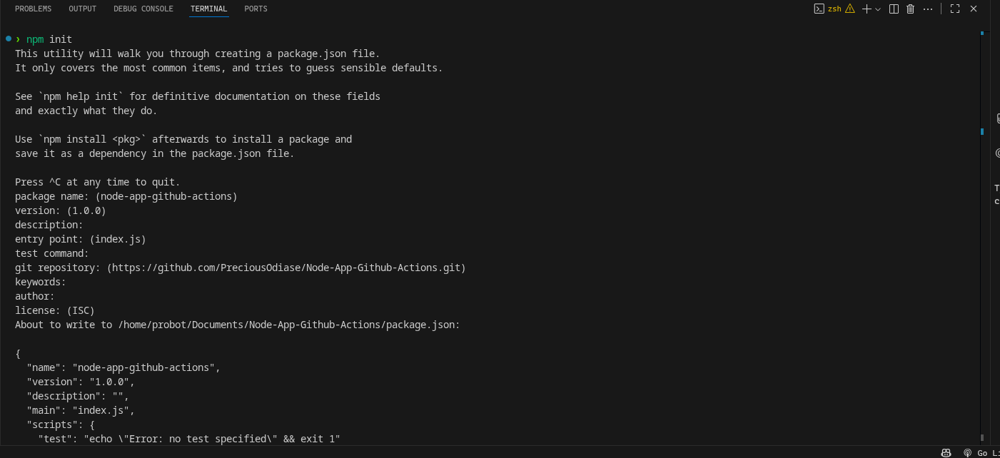
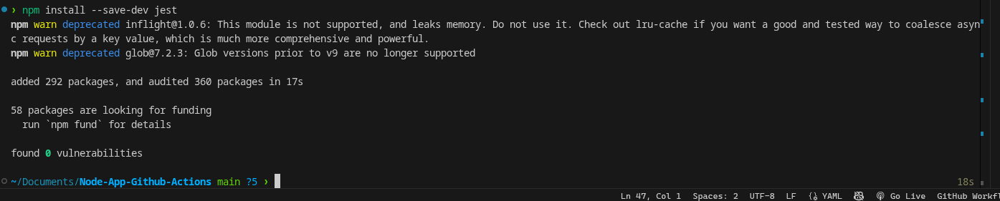
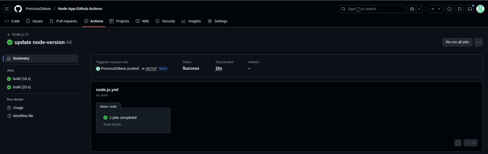
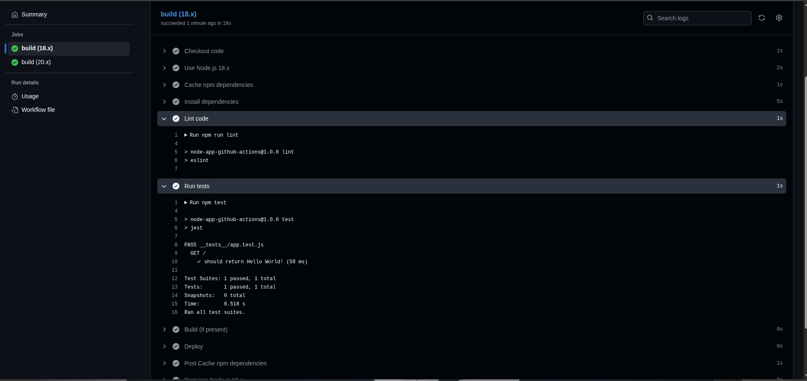

# Node-App-Github-Actions

This document outlines the steps taken to set up a Node.js project with Express, Jest testing, and GitHub Actions CI/CD.

---

## 1. Initialize Node.js Project

- Run `npm init` to create `package.json`.

```bash
npm init -y
Result: package.json file created.
```


 2. Install Dependencies
Installed Express for server functionality:

```bash
npm install express
```

Installed Jest for testing:

```bash
npm install jest --save-dev
```

Result: package-lock.json created and dependencies listed in package.json.




---

3. Project Structure

```
Node-App-Github-Actions/
│
├─ index.js          # Express server
├─ package.json
├─ package-lock.json
├─ __tests__/
│   └─ app.test.js   # Jest test file
└─ .github/
    └─ workflows/
        └─ node.js.yml  # GitHub Actions workflow
```

4. Express Server Setup
   index.js

```javascript
const express = require('express');
const app = express();
const port = process.env.PORT || 3000;

app.get('/', (req, res) => {
  res.send('Hello World!');
});

if (require.main === module) {
  app.listen(port, () => {
    console.log(`App listening at http://localhost:${port}`);
  });
}

module.exports = app;
Verified locally:

```

```bash
npm start
```

5. Jest Testing
   tests/app.test.js

```javascript
const request = require("supertest");
const app = require("../index");

describe("GET /", () => {
  it("should return Hello World!", async () => {
    const res = await request(app).get("/");
    expect(res.text).toBe("Hello World!");
    expect(res.statusCode).toBe(200);
  });
});
```

Run tests:

```bash
npm test
```

6. GitHub Actions Workflow
   .github/workflows/node.js.yml

```yaml
name: Node.js CI

on:
  push:
    branches: [main]
  pull_request:
    branches: [main]

jobs:
  build:
    runs-on: ubuntu-latest

    strategy:
      matrix:
        node-version: [18.x, 20.x]

    steps:
      - name: Checkout repository
        uses: actions/checkout@v3

      - name: Use Node.js ${{ matrix.node-version }}
        uses: actions/setup-node@v3
        with:
          node-version: ${{ matrix.node-version }}

      - name: Install dependencies
        run: npm ci

      - name: Build (if present)
        run: npm run build --if-present

      - name: Run tests
        run: npm test
```

7. Notes
   package-lock.json ensures reproducible installs for CI/CD.

Node 18+ is required to run Jest 30 due to os.availableParallelism() function.

.gitignore should include:

```bash
node_modules/
.env
```



---

### Workflow Features

- **Dependency Caching**: Speeds up CI runs by caching `node_modules` based on `package-lock.json`.
- **Linting with ESLint**: Ensures code quality using a Node.js + Jest ESLint flat config.
- **Automated Testing with Jest**: Runs unit tests for every push and pull request.
- **Deployment Placeholder**: Ready for integration with your deployment provider (Heroku, Vercel, AWS, etc.).
- **Ignored Triggers**: Changes to `README.md` do not trigger CI.

1. On each push or PR to `main` (except `README.md` changes), GitHub Actions runs:
   - **Install**: `npm ci` with caching
   - **Lint**: `npm run lint`
   - **Test**: `npm test`
   - **Build**: `npm run build --if-present`
   - **Deploy**: Placeholder command (to be replaced with real deployment)


