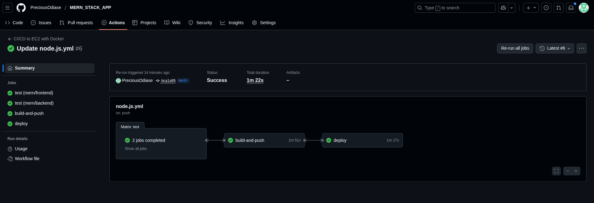
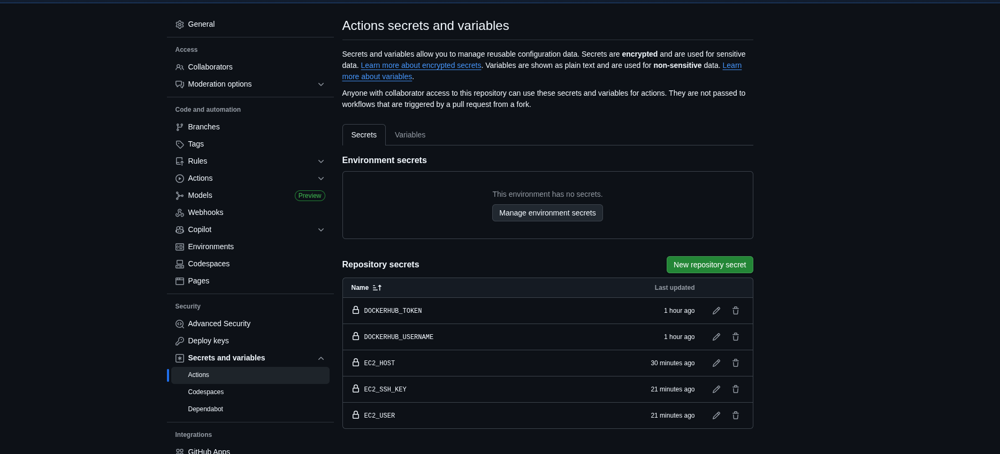
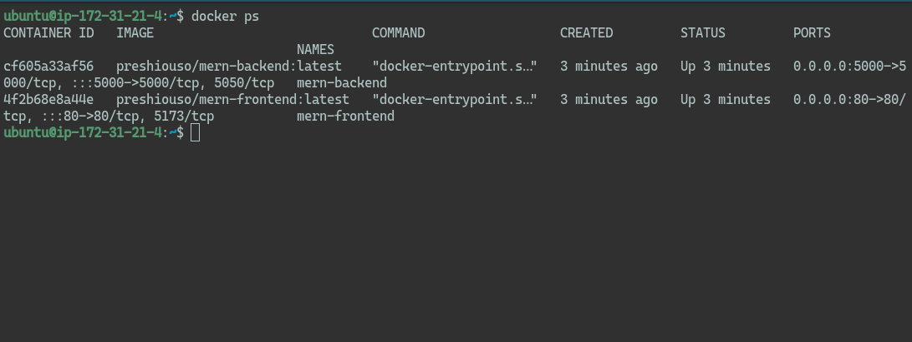

# A simple MERN stack application

This app has three primary components:
The Frontend(React, Tailwind CSS, HTML); A web application for user to interact.
The Backend(Nodejs, Express); Handling the logic of the frontend
The Database(MongoDB); Stores data and communicates with the backend to retrieve and store data from the user.

### Create a network for the docker containers

`docker network create mern`

### Build the client

```sh
cd mern/frontend
docker build -t mern-frontend .
```


### Run the client

`docker run --name=frontend --network=mern -d -p 5173:5173 mern-frontend`

### Verify the client is running

Open your browser and type `http://localhost:5173`

### Run the mongodb container

`docker run --network=mern --name mongodb -d -p 27017:27017 -v ~/opt/data:/data/db mongo:latest`


### Build the server

```sh
cd mern/backend
docker build -t mern-backend .
```


### Run the server

`docker run --name=backend --network=mern -d -p 5050:5050 mern-backend`

## Using Docker Compose

`docker compose up -d`

---

# GitHub Actions CI/CD

The project is set up with a GitHub Actions workflow to automate build, test, and deployment:

- Builds frontend and backend Docker images.

- Pushes images to Docker Hub.

- SSHes into an EC2 instance and pulls + runs the latest containers.
  

### Secrets required:

- DOCKERHUB_USERNAME – your Docker Hub username

- DOCKERHUB_TOKEN – Docker Hub access token

- EC2_HOST – public IP or DNS of EC2

- EC2_USER – usually ubuntu or ec2-user

- EC2_SSH_KEY – private key content of the SSH key associated with the EC2 instance



### Workflow Notes

- Ensure Docker is installed on the EC2 instance.

- Make sure the frontend and backend use the same Docker network for proper communication.

- The workflow skips tests for now if no npm test scripts are defined.



