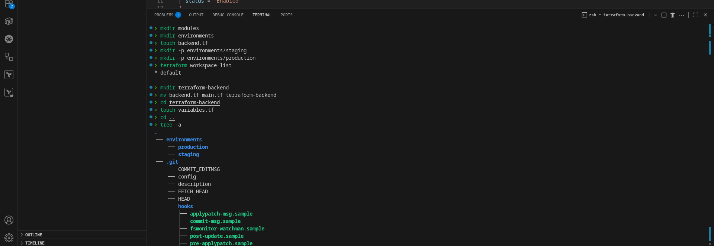
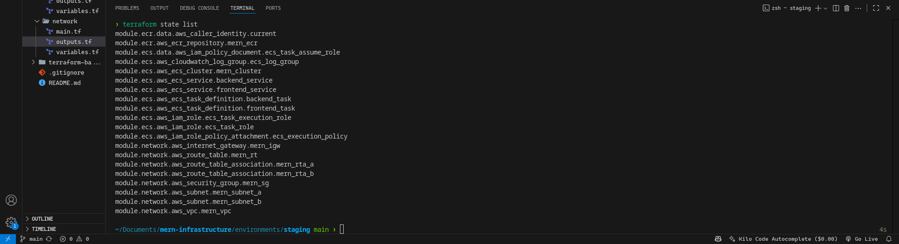
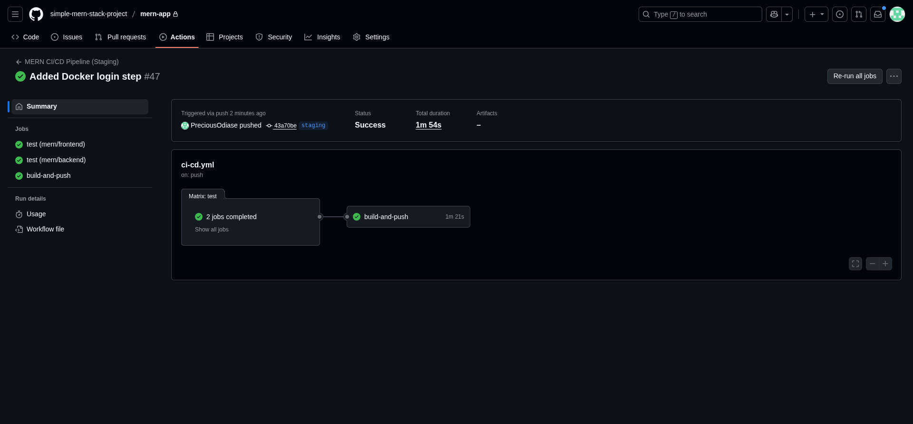
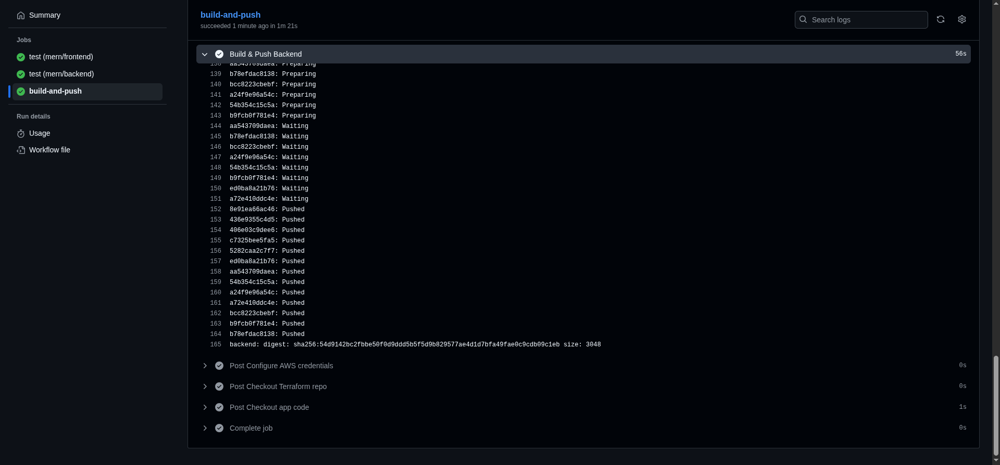
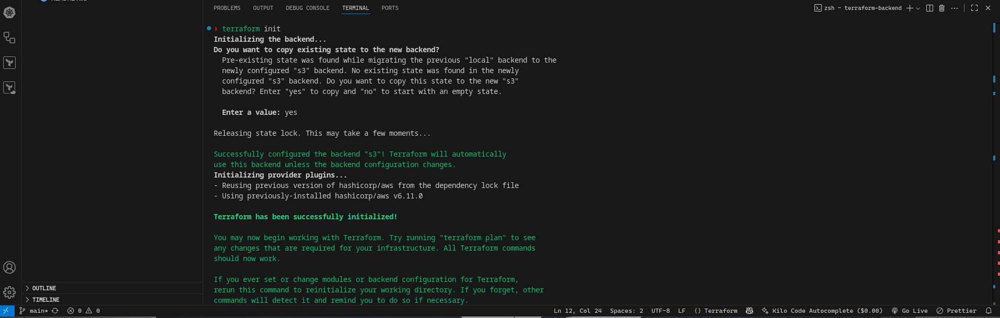
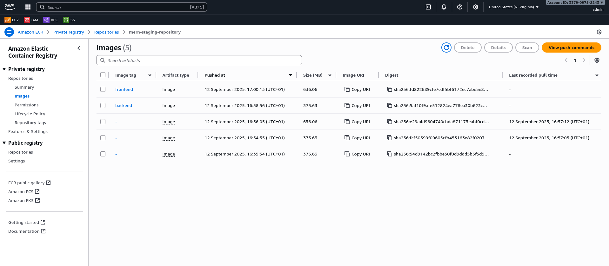
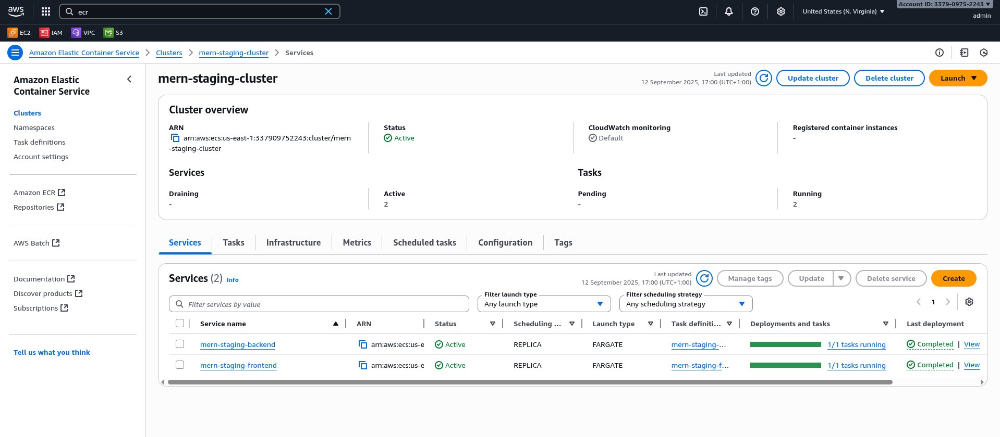
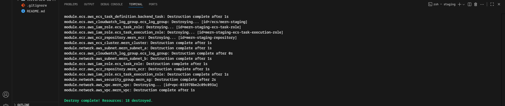

# MERN Stack Infrastructure on AWS with Terraform & GitHub Actions

This repository sets up and deploys a MERN (MongoDB, Express, React, Node.js) application to AWS ECS Fargate, using Terraform for infrastructure as code and GitHub Actions for CI/CD.

## 🌐 Architecture Overview

- Frontend & Backend: Dockerized React frontend and Node.js/Express backend

- MongoDB: Runs as a sidecar container inside the backend task definition

- ECS Fargate: Serverless container orchestration for frontend and backend services

- ECR: Docker image registry

- CloudWatch: Log aggregation for ECS containers

- S3: Remote backend for Terraform state

- GitHub Actions: Automated build, push, and deploy pipelines

## 📁 Repository Structure

```bash
├── environments
│   ├── production
│   └── staging
├── modules
│   ├── ecr
│   ├── ecs
│   └── network
├── terraform-backend
└── README.md

```

## 

## 🚀 Deployment Process

### 🔧 Infrastructure

Terraform modules set up:

- VPC, Subnets, Security Groups

- ECS Cluster and Services (Frontend, Backend)

- ECR Repository for Docker images

- IAM Roles for ECS Execution and Task

- CloudWatch Log Group
  

### 🛠 GitHub Actions Workflow

On push to the main branch:

1. Checkout code and Terraform repo

2. Configure AWS credentials

3. Initialize Terraform with S3 backend

4. Extract ECR repository URL

5. Build and push backend Docker image




### 🧪 Terraform Backend Configuration

Remote state is managed in S3.

```hcl
terraform {
  backend "s3" {
    bucket = "state-bucket-8932"
    key    = "mern-app/staging/terraform.tfstate"
    region = "us-east-1"
  }
}


```

Ensure your CI/CD environment has the following AWS credentials in GitHub Secrets:

- AWS_ACCESS_KEY_ID

- AWS_SECRET_ACCESS_KEY

---

### 📦 ECR Repository

Docker images were pushed to:

```bash
337909752243.dkr.ecr.us-east-1.amazonaws.com/mern-staging-repository

```

Tagged as:

- :backend

- :frontend
  

### 🔍 ECS Task Definitions

#### Backend Task (Fargate)

- Container: backend

- Sidecar: mongo

- Port: ${var.app_port} (default: 80)

- Env: MONGO_URL=mongodb://mongo:27017/<db>

#### Frontend Task (Fargate)

- Container: frontend

- Port: 80

- Assumes static build served via Nginx or Node.js
  

### 🔐 IAM Roles

ECS Execution Role:

- Attached to: ecs-tasks.amazonaws.com

- Policy: AmazonECSTaskExecutionRolePolicy

ECS Task Role:

- Custom role for container permissions (e.g., accessing secrets or S3)

### 🛑 Common Issues

- 504 Gateway Timeout: Check if tasks are running; verify networking, logs, and security groups.

- ECR image not found: Ensure correct image tag (:backend) is used in ECS task definition.

- ECS task won't start: Inspect CloudWatch logs and ECS console events.

### 📡 Accessing the App

Since Application Load Balancer wasn't used, tasks was assigned a public IP address and listened on port 80. Get the public IP of the ECS task from the AWS Console and open it in the browser.

### Cleanup

```hcl

terraform destroy

```



### ✅ Prerequisites

- AWS Account

- Terraform CLI

- GitHub Secrets for AWS credentials

- Docker installed for local builds (optional)
