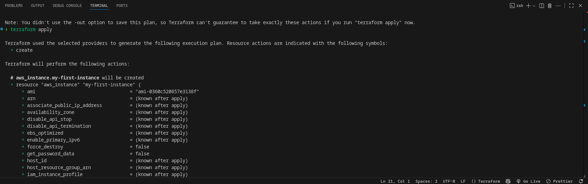
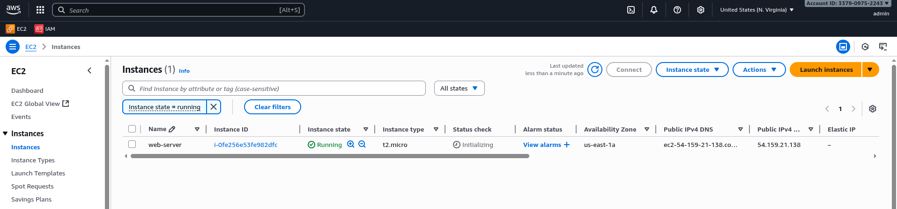
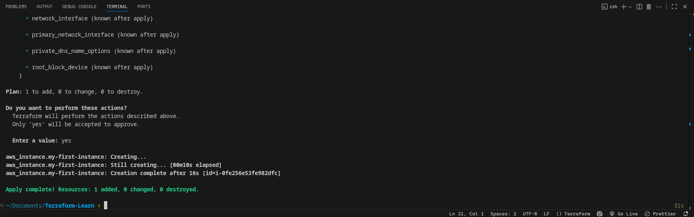

# Terraform: EC2 Instance and AMI Creation Project

This project demonstrates how to:

- Provision an EC2 instance with Terraform
- Create a custom AMI from that instance
- Modify infrastructure
- Clean up resources

## 📌 Prerequisites Verification

Verify AWS CLI configuration:

- AWS CLI must be installed to interact with AWS from the terminal.

```bash
aws --version
```

## ✅ AWS Authentication

Run the following command to confirm you are authenticated:

```bash
aws sts get-caller-identity
```

- Add the neccessary permisions for creating and deleting the specific resources in AWS.

## 📁 Project Setup

```hcl
provider "aws" {
  region = "us-east-1"
}

resource "aws_instance" "example" {
  ami           = "ami-0c55b159cbfafe1f0"
  instance_type = "t2.micro"

  vpc_security_group_ids = [aws_security_group.sg.id]

  tags = {
    Name = "web-server"
  }
}

resource "aws_security_group" "sg" {
  name        = "allow_ssh"
  description = "Allow SSH"

  ingress {
    from_port   = 22
    to_port     = 22
    protocol    = "tcp"
    cidr_blocks = ["0.0.0.0/0"]
  }

  egress {
    from_port   = 0
    to_port     = 0
    protocol    = "-1"
    cidr_blocks = ["0.0.0.0/0"]
  }
}
```

## 🔄 Terraform Workflow

Initialize Terraform

```bash
terraform init
```

4. Validate the Configuration

```bash
terraform validate
```

5. Apply Configuration

```bash
terraform apply
```





## 🧹 Clean Up Resources

7. Destroy Infrastructure

```bash
terraform destroy
```

## 📖 Observations & Lessons Learned

- Terraform Validate is helpful to catch errors early before provisioning resources.
- When using a custom AMI resource, ensure the instance is in a proper state before imaging.
- Key pairs must already exist in AWS for EC2 creation to succeed.
- Updating the instance type triggers a recreation of the instance.
- Terraform destroy effectively removes all provisioned resources but requires careful use to avoid accidental deletion.
