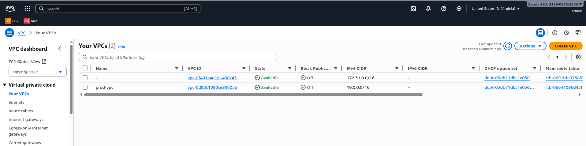
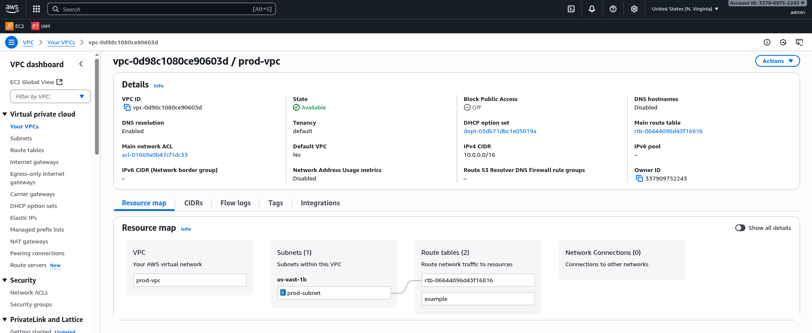
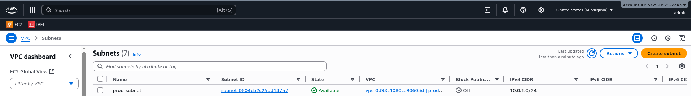
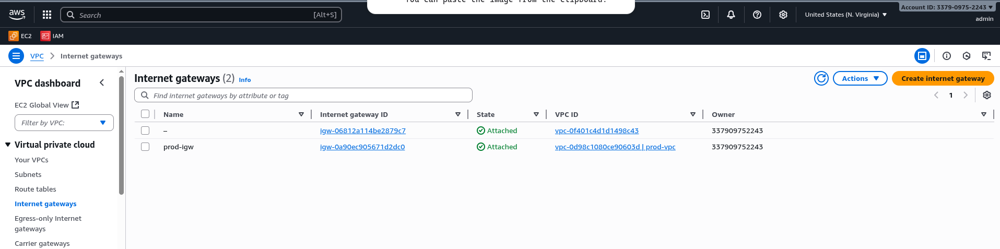
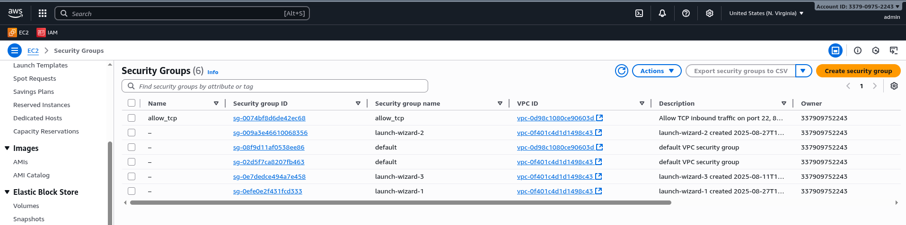
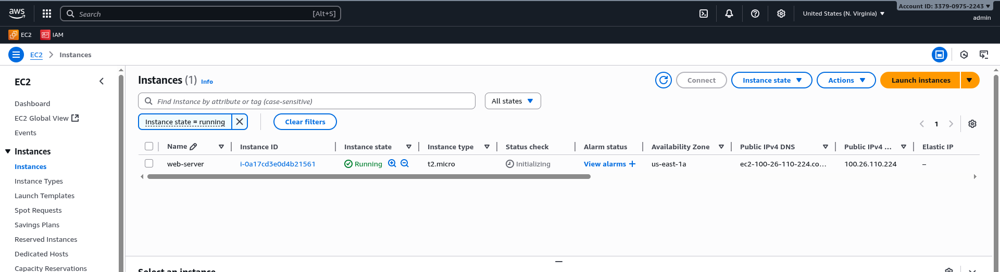
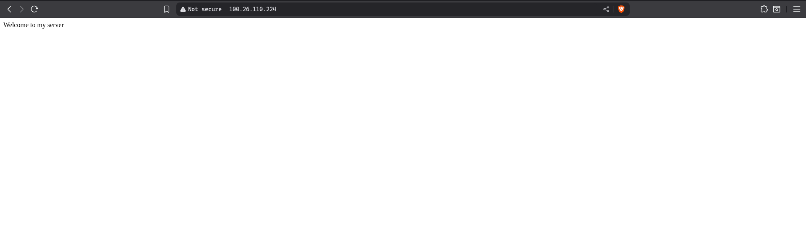
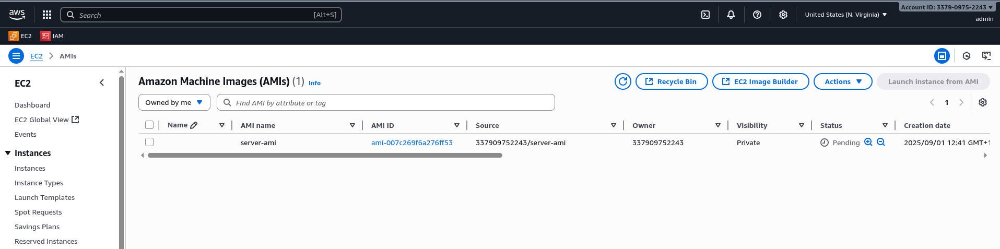
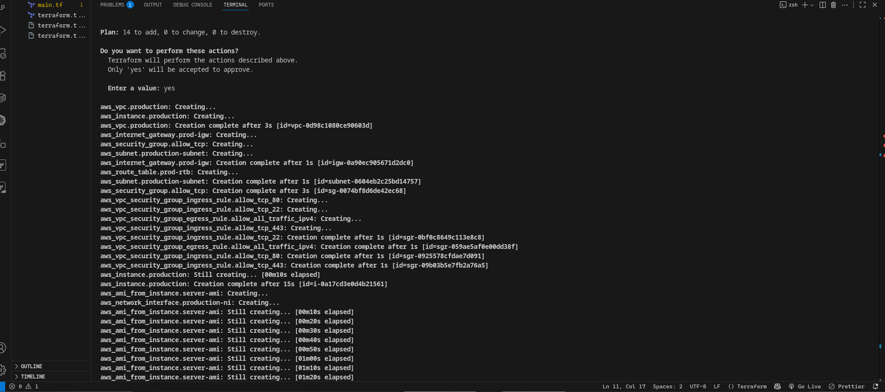
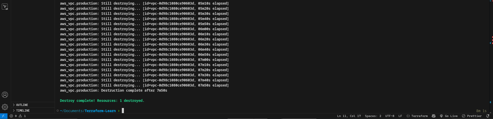

# 🚀 Terraform AWS EC2 + AMI Automation Project

This project uses **Terraform** to automate the provisioning of a complete AWS environment including a **VPC**, **subnet**, **Internet Gateway**, **route table**, **security group**, **EC2 instance**, and finally creates a **custom Amazon Machine Image (AMI)** from the instance.

---

## 📁 Project Structure

terraform-ec2-ami/
│
├── main.tf # Main Terraform configuration
├── variables.tf # (Optional) Input variables
├── outputs.tf # (Optional) Output values
└── README.md # Project documentation

```yaml
# Configure AWS Provider
terraform {
  required_providers {
    aws = {
      source  = "hashicorp/aws"
      version = "6.11.0"
    }
  }
}

provider "aws" {
  region = "us-east-1"
}


# Create a VPC

resource "aws_vpc" "production" {
  cidr_block = "10.0.0.0/16"

  tags = {
    Name = "prod-vpc"
  }
}

# Create Internet GAteway

resource "aws_internet_gateway" "prod-igw" {
  vpc_id = aws_vpc.production.id

  tags = {
    Name = "prod-igw"
  }
}


# Create custom Route Table

resource "aws_route_table" "prod-rtb" {
  vpc_id = aws_vpc.production.id

  route {
    cidr_block = "0.0.0.0/0"
    gateway_id = aws_internet_gateway.prod-igw.id
  }

  route {
    ipv6_cidr_block = "::/0"
    gateway_id      = aws_internet_gateway.prod-igw.id
  }

  tags = {
    Name = "example"
  }
}


# Create Subnet

resource "aws_subnet" "production-subnet" {
  vpc_id     = aws_vpc.production.id
  cidr_block = "10.0.1.0/24"

  tags = {
    Name = "prod-subnet"
  }
}

# Associate subnet with route table

resource "aws_route_table_association" "rtb-assc" {
  subnet_id      = aws_subnet.production-subnet.id
  route_table_id = aws_route_table.prod-rtb.id
}

# Create security group to allow port 22, 80, 443

resource "aws_security_group" "allow_tcp" {
  name        = "allow_tcp"
  description = "Allow TCP inbound traffic on port 22, 80, 443 and all outbound traffic"
  vpc_id      = aws_vpc.production.id

  tags = {
    Name = "allow_tcp"
  }
}

resource "aws_vpc_security_group_ingress_rule" "allow_tcp_443" {
  security_group_id = aws_security_group.allow_tcp.id
  cidr_ipv4         = "0.0.0.0/0"
  from_port         = 443
  ip_protocol       = "tcp"
  to_port           = 443
}

resource "aws_vpc_security_group_ingress_rule" "allow_tcp_22" {
  security_group_id = aws_security_group.allow_tcp.id
  cidr_ipv4         = "0.0.0.0/0"
  from_port         = 22
  ip_protocol       = "tcp"
  to_port           = 22
}

resource "aws_vpc_security_group_ingress_rule" "allow_tcp_80" {
  security_group_id = aws_security_group.allow_tcp.id
  cidr_ipv4         = "0.0.0.0/0"
  from_port         = 80
  ip_protocol       = "tcp"
  to_port           = 80
}

resource "aws_vpc_security_group_egress_rule" "allow_all_traffic_ipv4" {
  security_group_id = aws_security_group.allow_tcp.id
  cidr_ipv4         = "0.0.0.0/0"
  ip_protocol       = "-1" # semantically equivalent to all ports
}


# Create a network interface with an ip in the subnet created above
resource "aws_network_interface" "production-ni" {
  subnet_id       = aws_subnet.production-subnet.id
  private_ips     = ["10.0.1.50"]
  security_groups = [aws_security_group.allow_tcp.id]

  tags = {
    Name = "production-ni"
  }
}

# Assign an elastic ip to the network interface created above

resource "aws_eip" "prod-eip" {
  domain                    = "vpc"
  network_interface         = aws_network_interface.production-ni.id
  associate_with_private_ip = "10.0.1.50"
  depends_on                = [aws_internet_gateway.prod-igw]
}


# Create Ubuntu server and Install/Enable apache2

resource "aws_instance" "production" {
  ami           = "ami-0360c520857e3138f"
  instance_type = "t2.micro"

  # Attach network interface directly to the instance
  network_interface {
    network_interface_id = aws_network_interface.production-ni.id
    device_index         = 0
  }

  user_data = <<-EOF
#!/bin/bash
sudo apt update -y
sudo apt install apache2 -y
sudo systemctl start apache2
sudo bash -c 'echo Welcome to my server > /var/www/html/index.html'
EOF

  tags = {
    Name = "web-server"
  }
}

# Create AMI from instance

resource "aws_ami_from_instance" "server-ami" {
  name               = "server-ami"
  source_instance_id = aws_instance.production.id
}

```

---

## 🛠️ Features Implemented

- ✅ AWS Provider configuration
- ✅ Custom VPC
  
  
- ✅ Custom subnet
  
- ✅ Internet Gateway and route table setup
  
- ✅ Security Group allowing ports 22, 80, and 443
  
- ✅ Network Interface with Elastic IP
- ✅ Ubuntu EC2 instance with Apache2 installed via `user_data`
  
  
- ✅ Custom AMI created from the provisioned instance
  

---

## 🌐 AWS Resources Created

| Resource                | Description                              |
| ----------------------- | ---------------------------------------- |
| `aws_vpc`               | Custom VPC with CIDR block `10.0.0.0/16` |
| `aws_subnet`            | Subnet in the VPC                        |
| `aws_internet_gateway`  | Enables internet access                  |
| `aws_route_table`       | Routing for outbound internet traffic    |
| `aws_security_group`    | Allows TCP on ports 22, 80, 443          |
| `aws_network_interface` | ENI with static private IP               |
| `aws_eip`               | Elastic IP bound to the ENI              |
| `aws_instance`          | Ubuntu EC2 with Apache2 installed        |
| `aws_ami_from_instance` | Custom AMI created from EC2 instance     |

---



## 🔐 Security Group Rules

| Protocol | Port | Source    | Purpose            |
| -------- | ---- | --------- | ------------------ |
| TCP      | 22   | 0.0.0.0/0 | SSH Access         |
| TCP      | 80   | 0.0.0.0/0 | HTTP (Apache2)     |
| TCP      | 443  | 0.0.0.0/0 | HTTPS (Future Use) |

---

## 📦 Software Installed (via `user_data`)

The EC2 instance uses a bash script at launch to:

```bash
sudo apt update -y
sudo apt install apache2 -y
sudo systemctl start apache2
sudo bash -c 'echo Welcome to my server > /var/www/html/index.html'
```

## 🧹 Clean Up Resources

Destroy Infrastructure

```bash
terraform destroy
```


