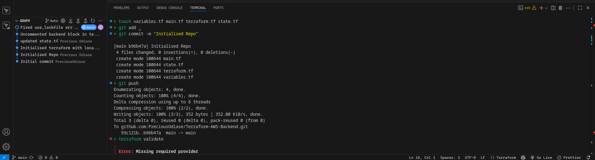
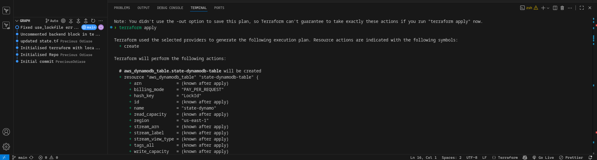
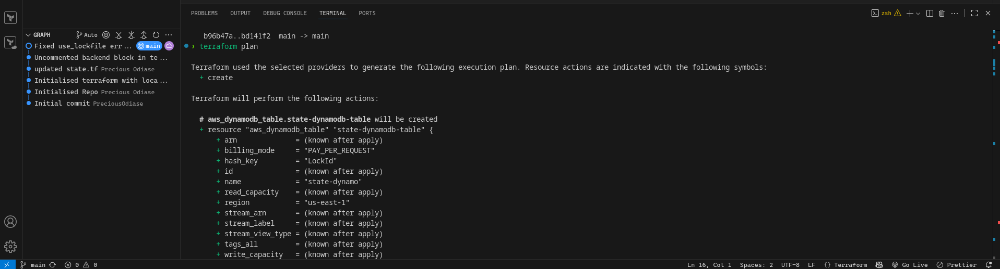
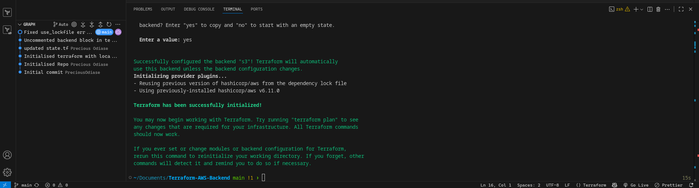
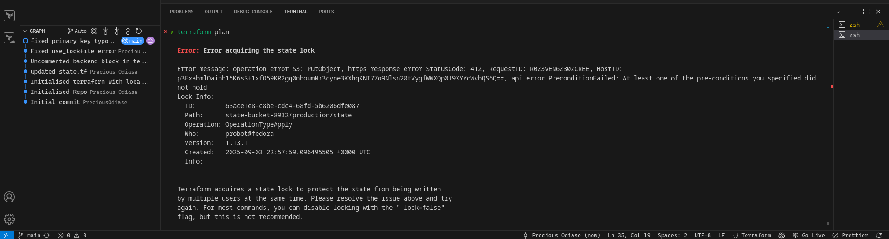

# Terraform Backend Bootstrap (AWS S3 + DynamoDB)

## Overview

This project bootstraps a **remote Terraform backend** using:

- **Amazon S3** — to store the Terraform state file
- **DynamoDB** — to handle state locking and prevent concurrent modifications

This setup follows Terraform and AWS best practices and was configured using the latest changes introduced in **Terraform v1.8+**.

---

## 🎯 Goals

- Create an S3 bucket with versioning and server-side encryption
- Create a DynamoDB table to be used for state locking
- Configure Terraform to use the remote backend with locking
- Migrate from local state to remote state safely

---

## 📁 Project Structure

| File           | Purpose                                        |
| -------------- | ---------------------------------------------- |
| `variables.tf` | Input variables for region, bucket, etc.       |
| `terraform.tf` | Backend and provider configuration             |
| `state.tf`     | Resources for S3 bucket and DynamoDB table     |
| `main.tf`      | Reserved for future infrastructure definitions |

---

## ✅ Steps Completed

### 1. Created AWS Resources for Remote Backend

Defined the following resources in `state.tf`:

- **S3 Bucket** (`aws_s3_bucket`)

  - Name: via `var.state_bucket`
  - `force_destroy = true` (for dev)
  - Versioning enabled
  - Server-side encryption (`AES256`) enabled

- **DynamoDB Table** (`aws_dynamodb_table`)
  - Name: via `var.state_dynamodb`
  - Billing mode: `PAY_PER_REQUEST`
  - Primary key: `LockID` (type: `S`) ← case-sensitive

### 2. Initialized Terraform with Local State

Before the backend could be used, the resources were created using the default (local) backend:

```bash
terraform init
terraform apply
```



### 3. Migrated to Remote Backend

Once the backend resources were in place, the terraform.tf file was updated to use the S3 backend with locking (Terraform v1.8+ syntax):

```terraform {
  backend "s3" {
    bucket          = "state-bucket-8932"
    key             = "production/state"
    region          = "us-east-1"
    use_lockfile   = true
    use_lock_table  = true
    lock_table      = "state-dynamo"
  }

  required_providers {s
    aws = {
      source  = "hashicorp/aws"
      version = "6.11.0"
    }
  }
}
```




Notes:

- dynamodb_table is deprecated in Terraform v1.8+.

- Replaced with use_lock_table and lock_table.

Terraform was then re-initialized:

```
terraform init
```

Terraform prompted to migrate the local state to the new backend — this was accepted.



### 🧪 Verification

- Ran terraform plan — confirmed backend works

- Confirmed state file in S3 and lock behavior using DynamoDB

- Validated that concurrent applies would trigger locking errors
  
