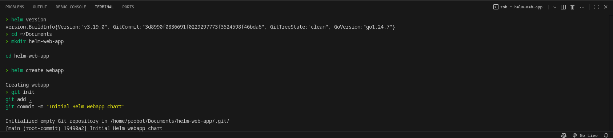
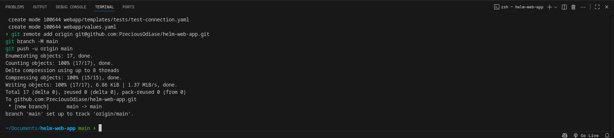

# Helm Chart Setup

This guide walks you through installing Helm, creating a new Helm chart, initializing a Git repository, and pushing the chart to the repository.

---

## 1. Installing Helm

Helm is a package manager for Kubernetes. Follow the steps below to install Helm on your machine.

### Prerequisites

- [kubectl](https://kubernetes.io/docs/tasks/tools/)
- Kubernetes cluster (local or cloud)
- curl / wget

### Installation Steps

**Using script (Linux/macOS):**

```bash
curl https://raw.githubusercontent.com/helm/helm/main/scripts/get-helm-3 | bash
```

```bash
helm version
```

## 2. Creating a New Helm Chart

Helm charts help you define, install, and upgrade Kubernetes applications.

Create a new chart:

```bash
helm create mychart
```

This will create the following directory structure:

mychart/
├── Chart.yaml
├── values.yaml
├── charts/
└── templates/



You can now modify the chart contents as needed.

## 3. Initializing a Git Repository

After generating your Helm chart, initialize a Git repo to track changes.

Steps:

```bash
cd mychart
git init
git add .
git commit -m "Initial commit - Add Helm chart"
```

This creates a new Git repo in your chart directory and stages the files.

## 4. Pushing to a Git Repository

Once your repo is initialized locally, push it to a remote repository.

GitHub:

```bash
git remote add origin https://github.com/yourusername/your-repo-name.git
git branch -M main
git push -u origin main
```



## Summary

By following this guide, you now have:

- Installed Helm

- Created a Helm chart

- Initialized a Git repository

- Pushed your code to a remote repo
