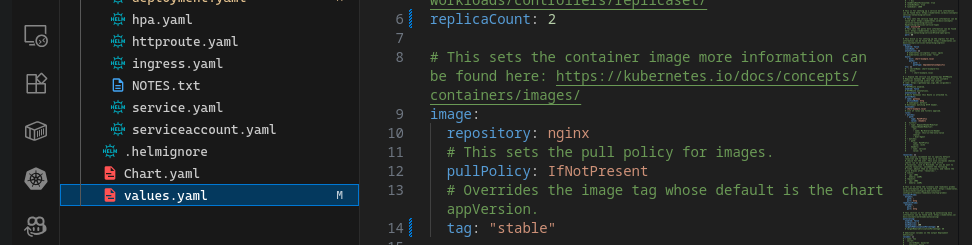
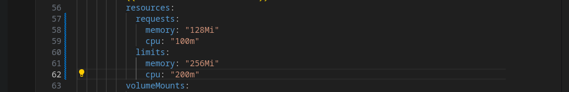
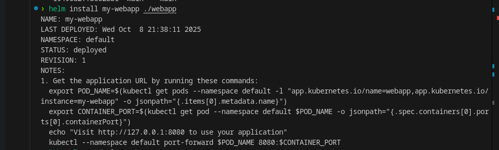
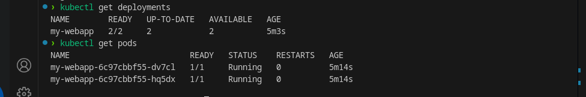
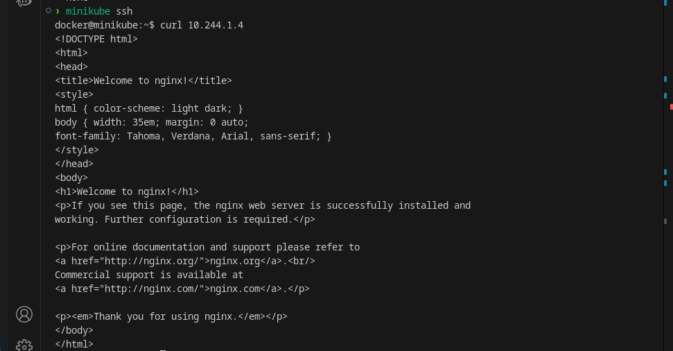

# Working with Helm: Modifying Values and Deployments

This guide covers how to modify Helm chart values, update deployment manifests, install a Helm release, and verify deployments with `kubectl`.

## 1. Modify `values.yaml`

Edit the `values.yaml` file to customize your application's configuration, such as image tags, replica counts, environment variables, etc.

```yaml
# values.yaml
replicaCount: 2

image:
  repository: nginx
  tag: stable
  pullPolicy: IfNotPresent
```



## 2. Update `deployment.yaml`

Adjust the Helm template in `templates/deployment.yaml` to use values from `values.yaml`:

```yaml
resources:
  requests:
    memory: "128Mi"
    cpu: "100m"
  limits:
    memory: "256Mi"
    cpu: "200m"
```



## 3. Install the Helm Chart

Run the following command to install or upgrade your Helm release:

```sh
helm install my-release ./
# or, to upgrade:
helm upgrade my-release ./
```



## 4. Verify the Deployment

Check the status of your deployment using kubectl:

```sh
kubectl get deployment
```

This will list all deployments and show their current status.

## 

## Visit URL


