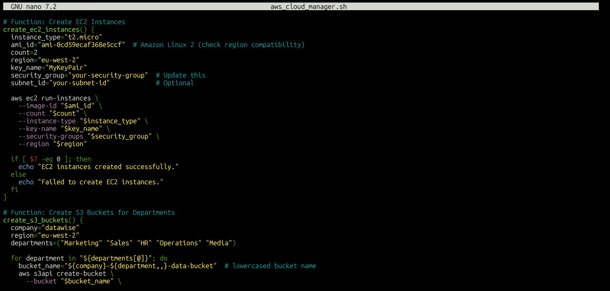
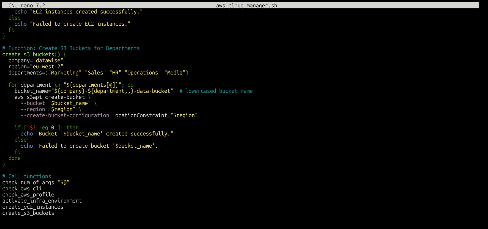

📝 Mini Project Summary
In this mini project, I learned how to automate cloud infrastructure setup using shell scripting and AWS CLI. I explored how to use environment variables to manage different configurations for local, testing, and production environments, which improves flexibility and security. I implemented command-line arguments to dynamically select the environment at runtime. I also created functions in the script to modularize tasks like checking prerequisites, creating EC2 instances (using Amazon Linux and t2.micro), and provisioning S3 buckets for various departments. Error handling was added to ensure smooth execution and feedback when issues occur, like missing AWS CLI or unset AWS profile. Through this project, I’ve developed a deeper understanding of infrastructure as code principles, scripting best practices, and AWS service automation.

