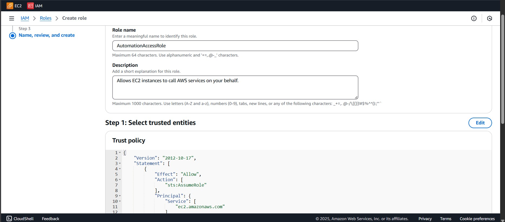
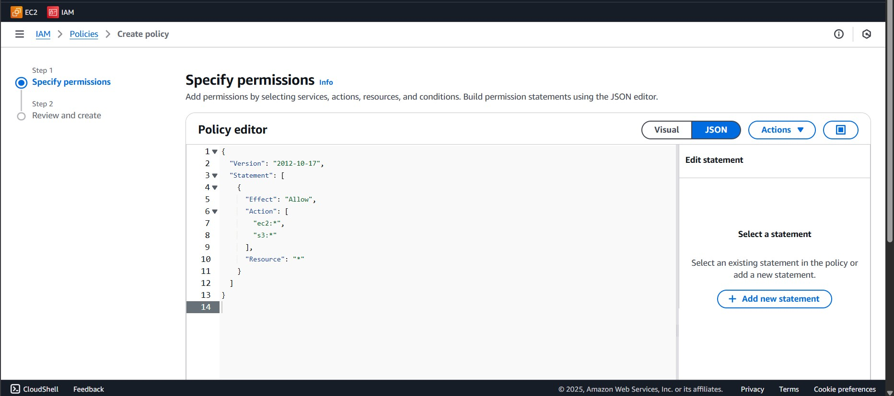
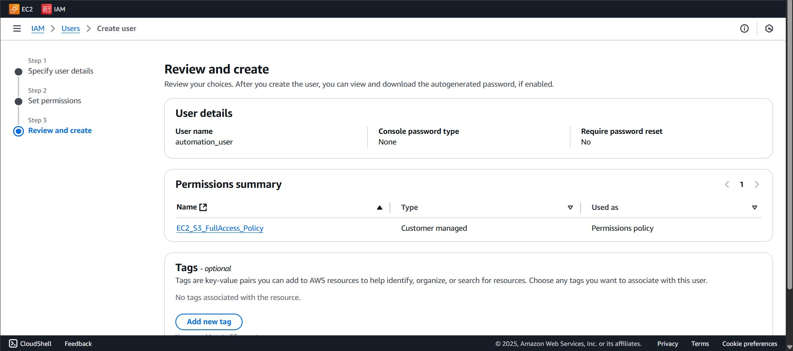
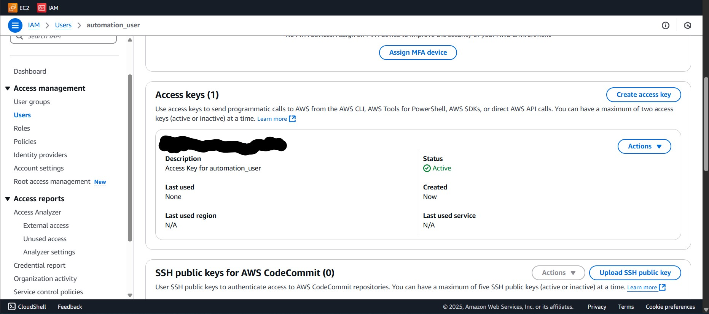
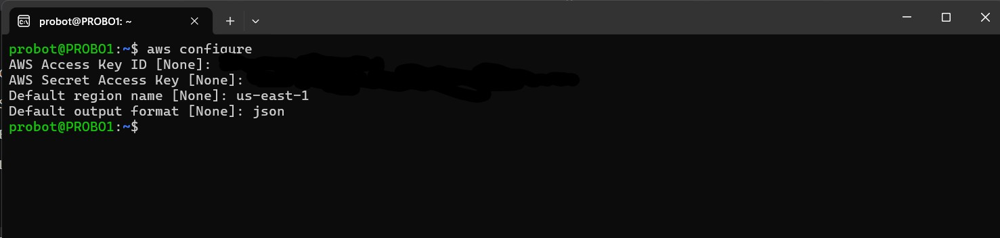
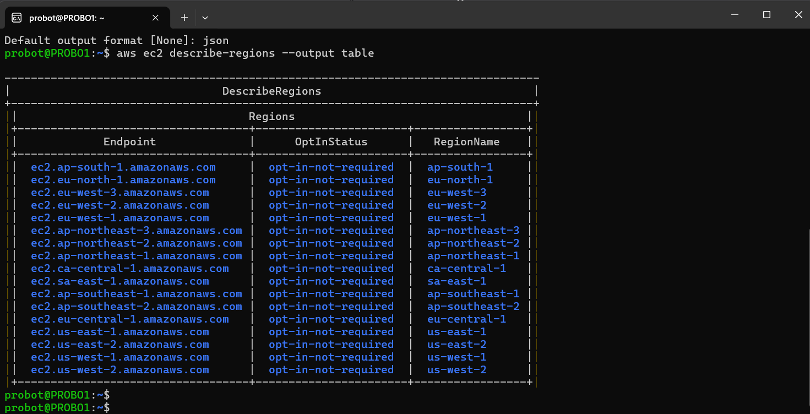

# Phase 2: AWS Authentication Setup for Automation Script

To enable our shell script to programmatically manage AWS resources (EC2 and S3), we must first set up the proper AWS authentication and permissions structure. This setup ensures the script can interact securely and efficiently with AWS services.

---

## 🛠️ Step-by-Step AWS Setup

### 1. Create an IAM Role
- **Purpose**: Encapsulate a set of permissions required by our automation script.
- This role defines **what actions** can be performed (e.g., launching EC2 instances, creating S3 buckets).



### 2. Create an IAM Policy
- **Policy Scope**: Grant **full access** to EC2 and S3 services.
- Use the AWS Policy Generator or JSON editor to define permissions.
- Sample actions:
  - `ec2:*`
  - `s3:*`




---


### 3. Create an IAM User: `automation_user`
- This user will act as the **identity** that runs the script.
- It will be assigned permissions to interact with AWS resources.
- Link `automation_user` to the IAM role created earlier.
- This allows the user to **inherit permissions** from the role.
- Directly attach the previously created IAM policy to `automation_user`.
- This step ensures that `automation_user` has the required access, even if not assuming a role.


---


### 4. Create Programmatic Access Credentials
- Generate **Access Key ID** and **Secret Access Key** for `automation_user`.
- These credentials will be used by the shell script to authenticate with the AWS CLI.



---

### Step 6: Configure AWS CLI (on your local/Linux system)
In the terminal, run:
``` bash
aws configure
```

---

### ✅ 6 Test Access to AWS 
``` bash
aws ec2 describe-regions --output table

```
