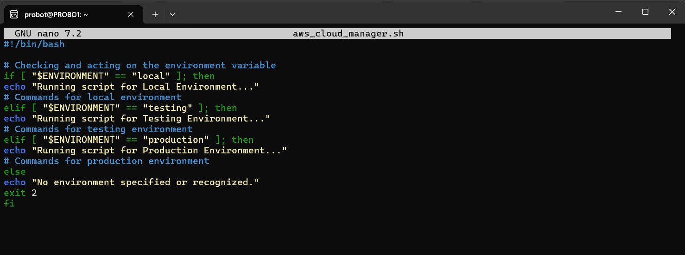
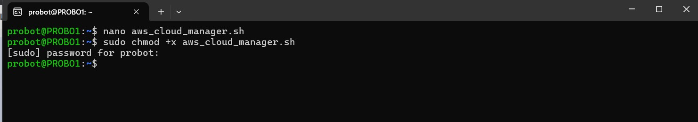

# ✅ Mini Project Summary: Environment Variables & Shell Scripting

In this mini project, I learned how to create a reusable and flexible shell script to manage AWS cloud infrastructure across different environments—**local**, **testing**, and **production**—using **environment variables** and **command line arguments**. I understood the importance of avoiding hard-coded values by using dynamic inputs instead. Environment variables allow us to define critical configuration details like database URLs, usernames, and passwords that vary by environment, enhancing both security and portability. Additionally, I learned how to use **positional parameters** to pass arguments to the script at runtime, enabling the script to determine which environment it is operating in. To ensure robustness, I also integrated a check to validate that exactly one argument is passed when running the script, helping prevent misuse or confusion. These foundational practices set the stage for building scalable, secure, and maintainable cloud automation tools.

