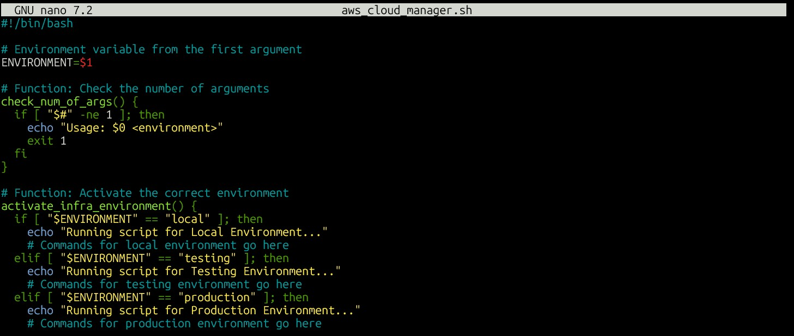
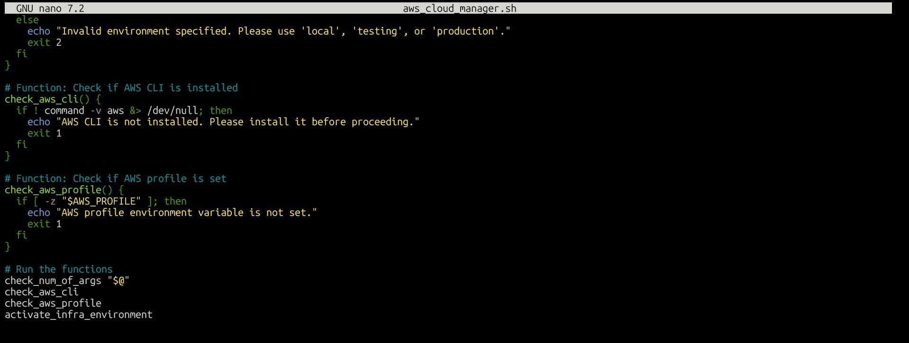

# Script Overview

The **aws_cloud_manager.sh** script is modular, with each function performing a specific task

### check_aws_cli(): 
- Verifies that the AWS CLI is installed.

### check_aws_profile(): 
- Validates that the specified AWS profile exists and is configured.

### activate_infos_environment(): 
- Switches to the specified environment using a case statement.

### check_num_of_args(): 
- Ensures exactly one argument is provided.

## Function Details

### check_aws_cli()
- Verifies the presence of the AWS CLI using aws --version.
- Exits the script with an error if the CLI is not installed.

### check_aws_profile()
- Uses the -z test to ensure the profile is provided and not empty.
- Confirms the profile exists in AWS configuration files.

### activate_infos_environment()
- Uses a case statement to handle switching between local, testing, and production.
- Sets the appropriate AWS CLI profile.
- Ensures only valid environments are accepted.

### check_num_of_args()
- Ensures the script receives exactly one argument (environment name).
- If not, displays a usage message and exits.

