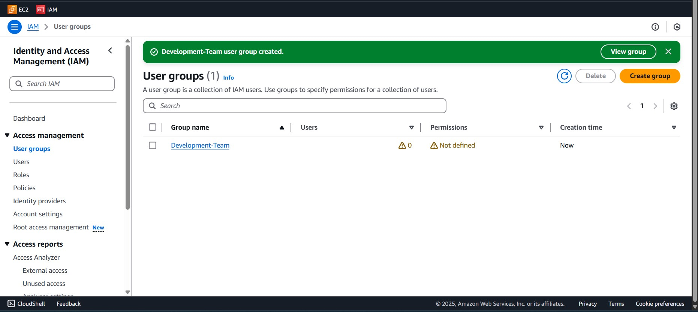
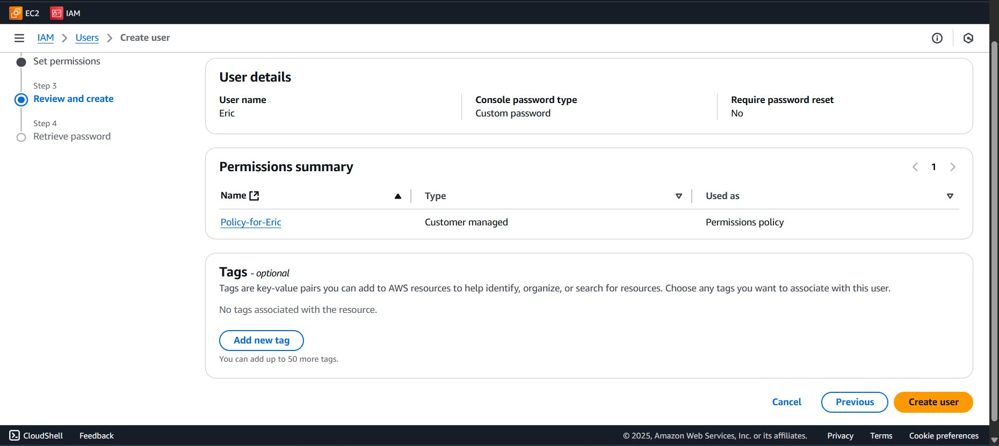
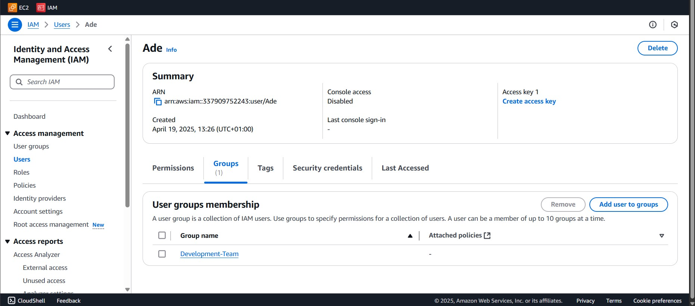
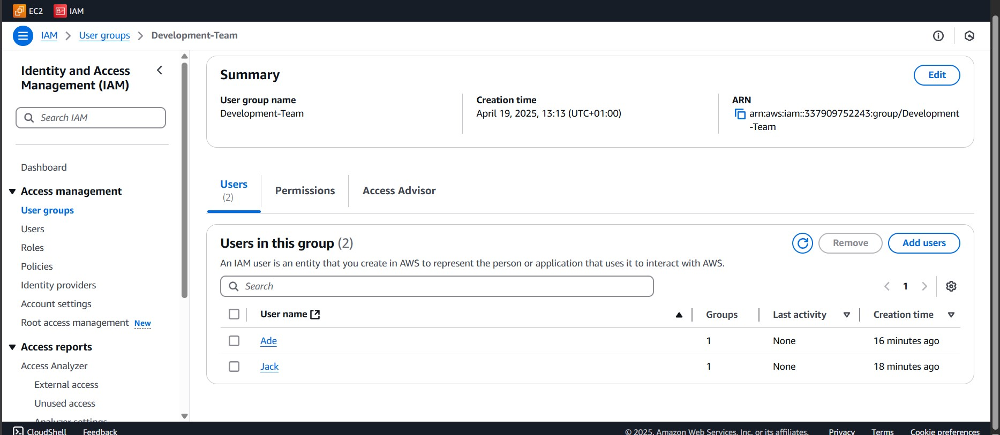
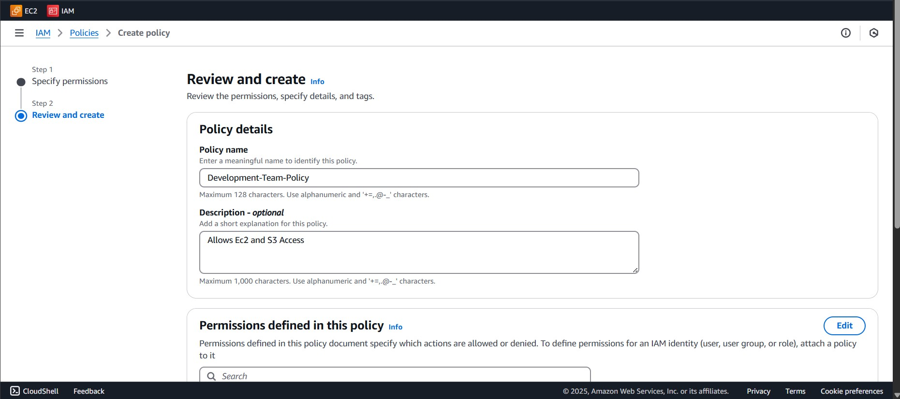
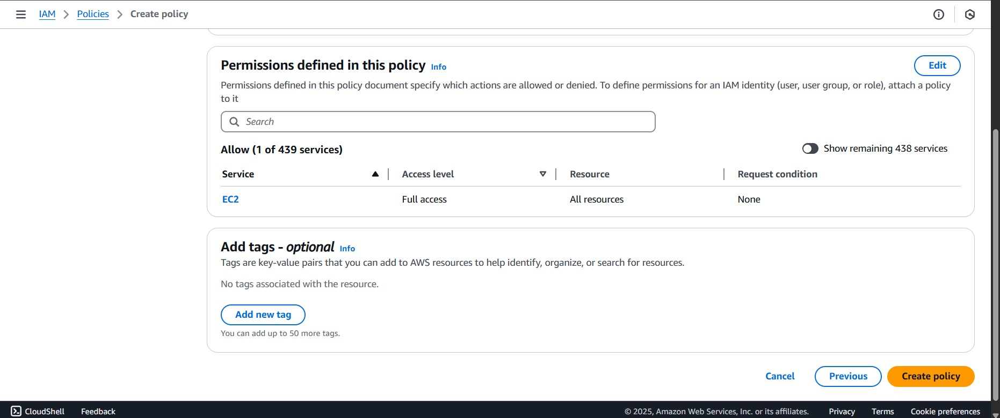
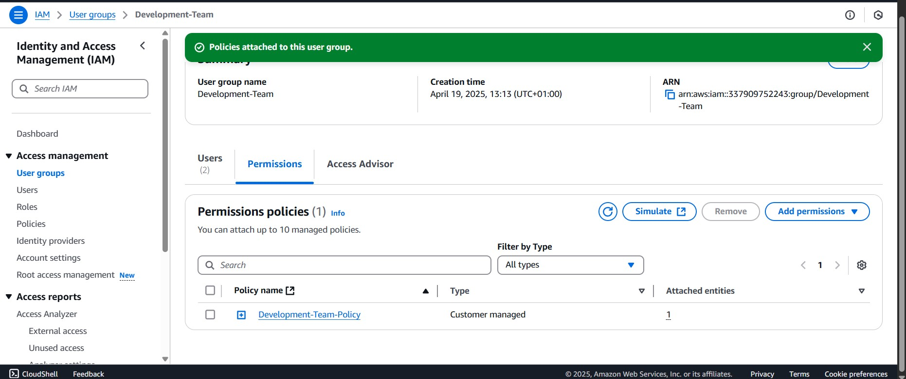

# AWS IAM Hands-On Project Report

## 📘 Introduction

This project demonstrates a practical implementation of AWS Identity and Access Management (IAM) by creating IAM users, groups, and a custom-managed policy. The goal was to simulate a real-world permissions structure and gain hands-on experience with access control in AWS. All steps were executed using the AWS Management Console, with supporting screenshots included.

---

## 🛠️ Step-by-Step Implementation

### ✅ Step 1: Create an IAM Group - `Developer-Team`

A group named `Developer-Team` was created to simplify user management and permission assignments.

---

### ✅ Step 2: Create IAM Users

One IAM user was created with Ec2 Access
- `Eric`

Two other users were created and added to the Development-Team
- `Ade`
- `Jack`

---

### ✅ Step 3: Create a Custom IAM Policy

Two customer-managed policies named `Development-Team-Policy` and `Policy-for-Eric` was created. 
The `Development-Team-Policy` gave full access to all S3 bucket and Ec2 instances while the `Policy-for-Eric` gave full access to only S3 and this was attached to the IAM user Eric

