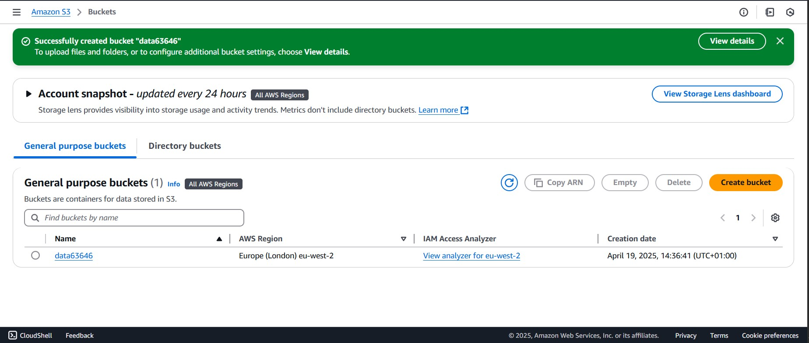
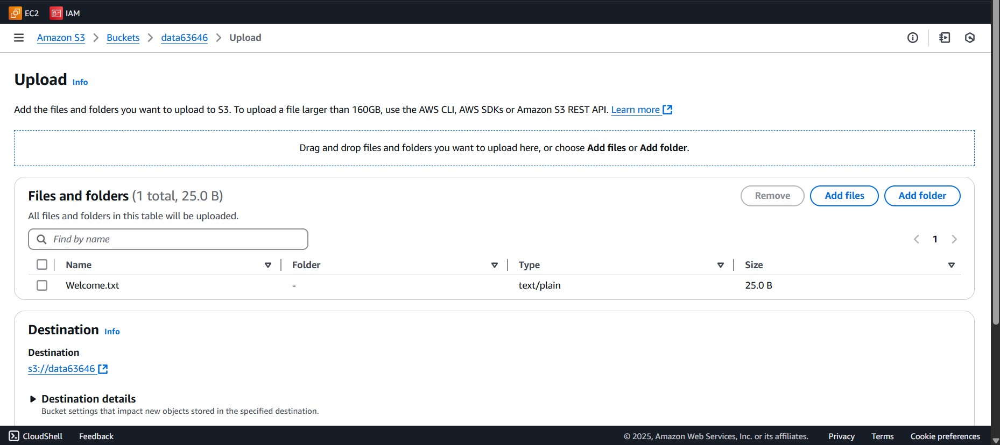
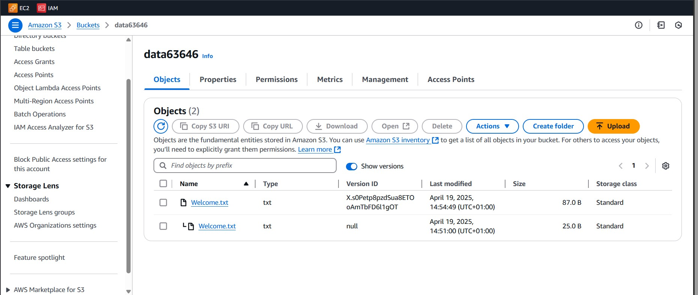
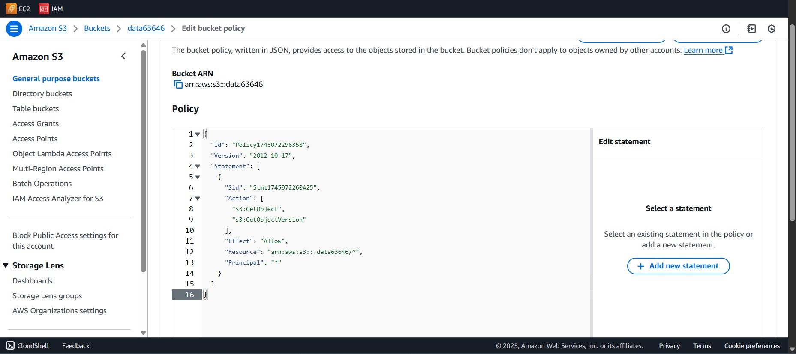
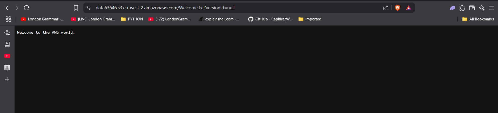
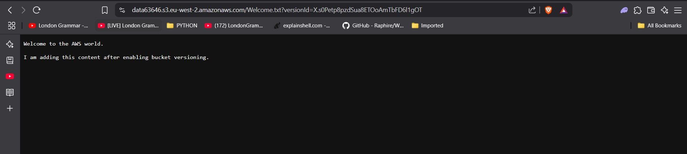
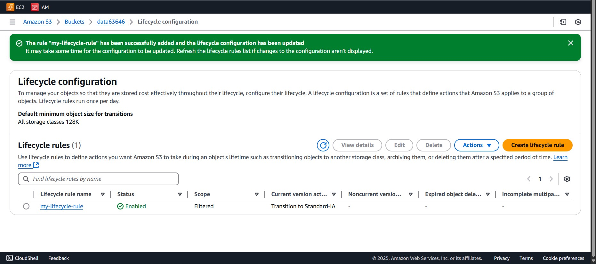

# AWS S3 Project Documentation

This document outlines the steps involved in setting up an AWS S3 bucket with versioning, bucket policy, and lifecycle management.

---

## 📦 1. Create an S3 Bucket
An S3 Bucket was created with the following configurations:
 
1. ACL Disabled" for object ownership.
2. Block all public access"
3. Bucket Versioning disabled.

---

## 🔁 2. Enabled Bucket Versioning

Versioning allows you to preserve, retrieve, and restore every version of every object stored in your bucket.

Data was uploaded and versioning enabled afterwards

I made changes to the data, then uploaded another version

---

## 🔐 3. View contents of the bucket
To view the contents of the bucket, the permission was changed to allow public access by unchecking the "Block all public access" option.

### Add a Bucket Policy

A bucket policy allows you to manage permissions for the bucket and its contents.

1. Set the "Effect" to "Allow",
2. Choose the action "Get object and "Get object version",

Version 1 of data

Version 2 of data

## 🗑️ 4. Configure Lifecycle Management
Lifecycle rules help you automatically transition objects to different storage classes or delete them after a specified time.
Lifecycle rule were created with these options;
1. Filter type ".txt"
2. Minimum object size "2"
3. Maximum Object size "10"
4. Transition to Objects move to Standard-IA, delete after 365 days).

