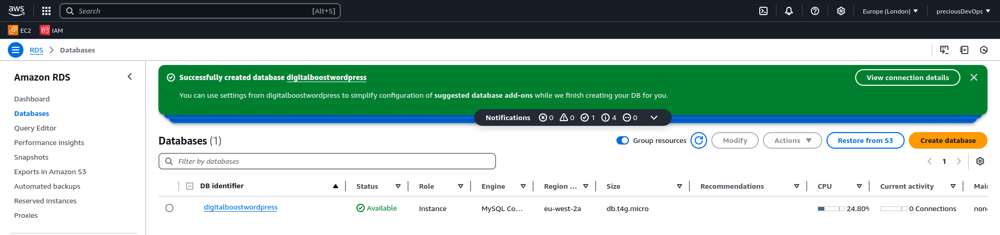
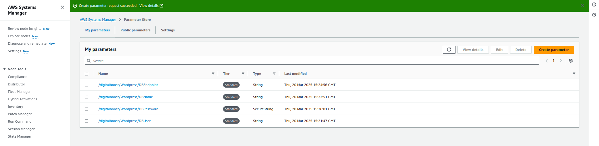
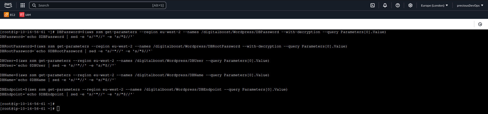
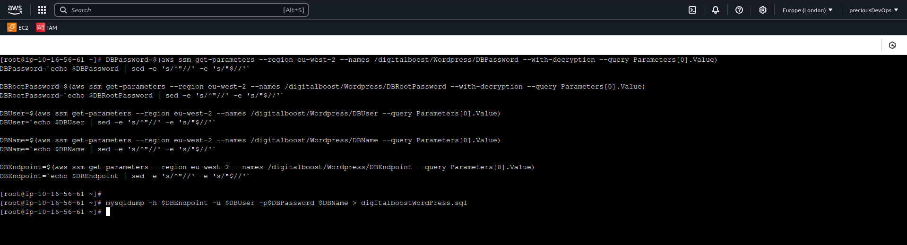
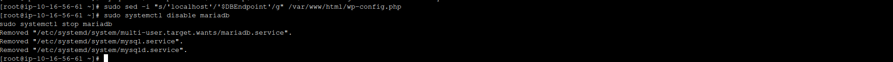

# 🗃️ My Amazon RDS Project: Database Management on AWS

Hey there! 👋 This doc walks through my experience setting up and managing a database using **Amazon RDS**. I used RDS to offload the heavy lifting of provisioning, managing, and scaling a relational database. Here's how I tackled it and what I learned.

---

## 🎯 Project Goal

Set up a **MySQL** database using Amazon RDS to be used by a web application hosted on EC2. The focus was on ease of maintenance, and better scalability than self-hosted DBs.

---

## 🧱 Step 1: Launching an RDS Instance

I chose **Amazon RDS for MySQL** as the engine.

### Setup highlights:

- **DB Engine:** MySQL
- **Instance Class:** db.t4g.micro (Free Tier)
- **Storage:** 20 GB General Purpose SSD
- **Multi-AZ:** No (dev/testing only)
- **VPC:** Same as my EC2
- **Subnet Group:** Public for now
- **Security Group:** Opened port 3306 to EC2 SG





---

## 🛡️ Step 2: Security Configuration

### RDS Security Group

- Allowed **Inbound MySQL (TCP 3306)** from my EC2’s security group.
- No public access — DB should only be accessed from the app.


---

## ⚙️ Step 3: Parameter Groups & Options

For basic dev work, I used parameter store to create the neccesary parameters.




---

## 🔗 Step 4: Connecting RDS to EC2

Once the RDS instance was available, I used the **endpoint and port** to connect from my EC2-hosted WordPress app (or Laravel in some other tests).

```bash
mysql -h your-db-endpoint.rds.amazonaws.com -u admin -p

```

## Step 5: Migrating the data from EC2 to RDS

### Take a Backup of the local DB
To take a backup of the database 
```bash
 mysqldump -h $DBEndpoint -u $DBUser -p$DBPassword $DBName > a41WordPress. sql
```



## Step 6: Configure Wordpress to use RDS and Delete MariaDB on EC2
I then proceeded to delete the DB on the EC2


