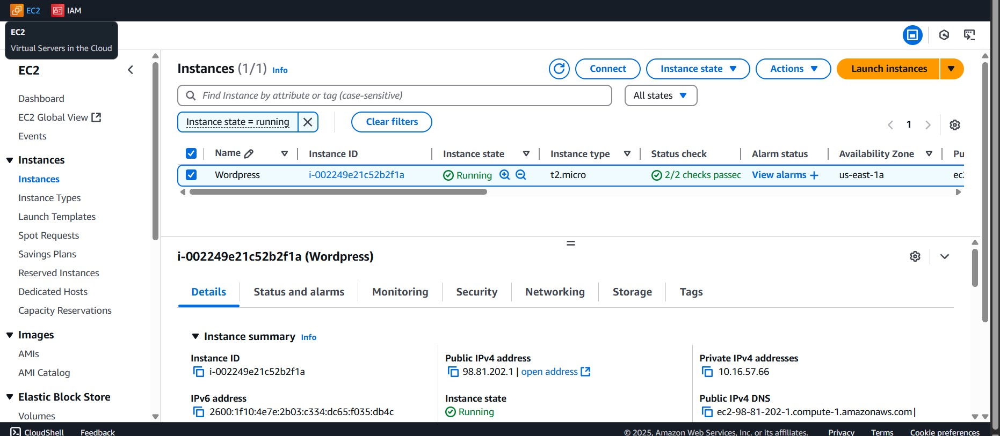
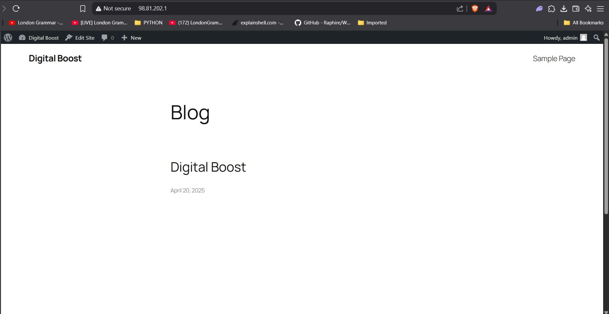
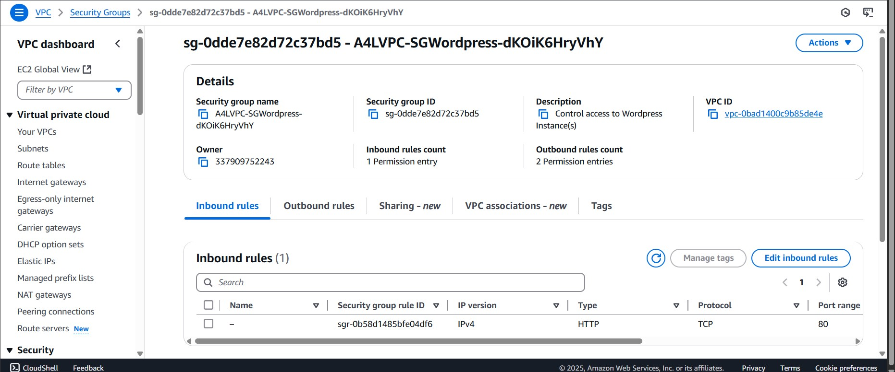
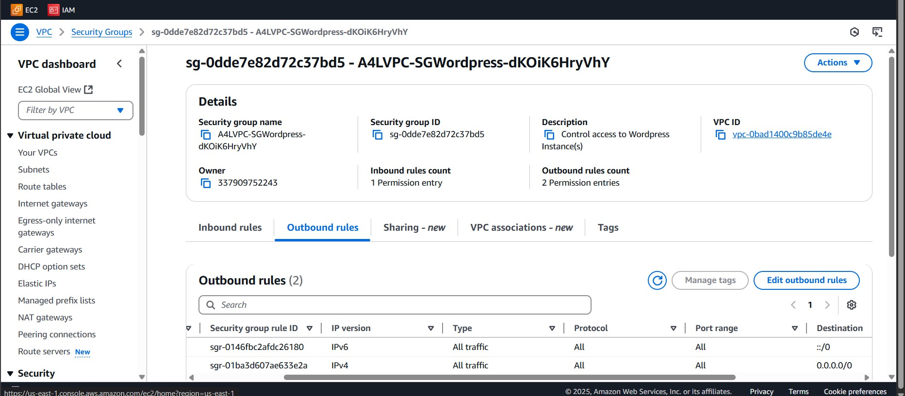
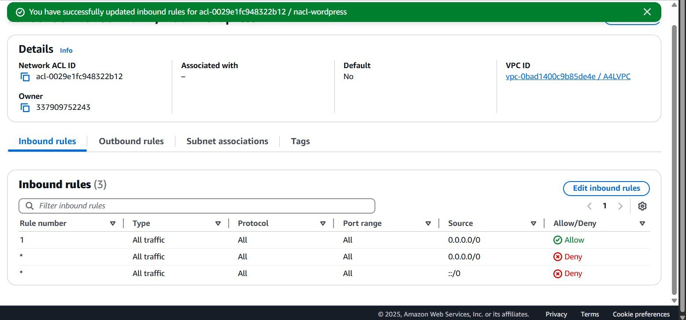
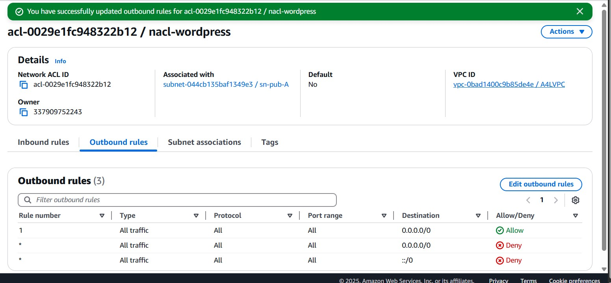
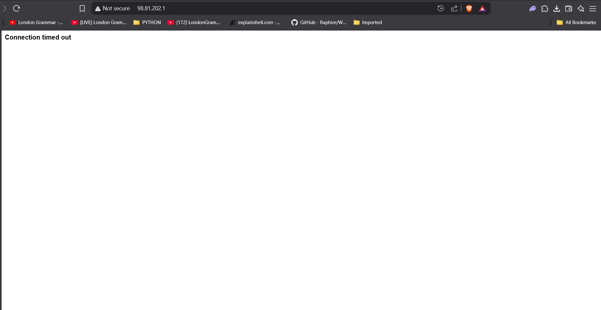
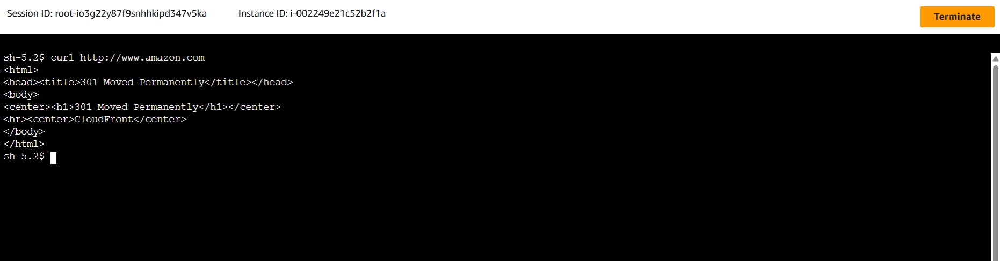

# AWS EC2 WordPress Project: Security Group and NACL Configuration

This document describes the configuration of **Security Groups (SG)** and **Network Access Control Lists (NACL)** for an AWS EC2 instance hosting a WordPress site. It includes steps for testing access via inbound and outbound rules.

---

## 🖥️ 1. Project Overview

- **Goal:** Deploy a WordPress site on an EC2 instance.
- **Security Focus:** Test and document how Security Groups and NACL rules affect access.

---

## ⚙️ 2. EC2 and WordPress Setup

1. Launched an Amazon Linux 2 EC2 instance.
2. Installed LAMP stack and WordPress.
3. Associated an Elastic IP for easier testing.
4. Verified WordPress site is up and accessible.

---

## 🔐 3. Security Group Configuration

### Inbound Rules

### Outbound Rules

---

## 🛡️ 4. NACL Configuration

Associated with the subnet where the EC2 instance resides.

### Inbound Rules

### Outbound Rules

---

## 🧪 5. Testing Access

### ✅ Successful:

- Accessed WordPress from browser using HTTP.
- SSH access from trusted IP.
- Outbound connections from EC2 (e.g., WordPress fetching plugins).

### ❌ Blocked (on purpose):

- SSH from other IPs.
- HTTP access if NACL or SG rule was temporarily removed.

---

