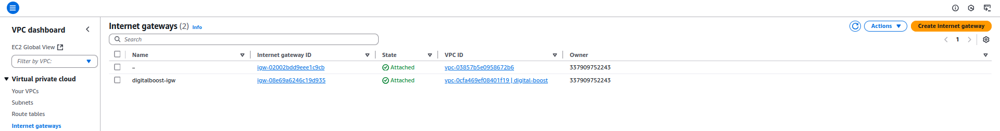

# 🚀 WordPress on AWS – Scalable, Resilient Architecture

Hi there! 👋  
This Markdown doc captures the architecture and setup I used to deploy a **WordPress website on AWS** using a well-structured VPC, RDS for MySQL, EFS for shared storage, and a Load Balanced Auto Scaling environment. The project was built with scalability, availability, and modularity in mind.

---

## 🌐 VPC Architecture Overview

I designed a custom VPC with public and private subnets across three Availability Zones (AZs):

- **Public Subnets:** Hosted the Load Balancer and NAT Gateway.
- **Private Subnets:** Hosted the EC2 WordPress instances and Amazon RDS.

A NAT Gateway was configured in the public subnet to allow instances in private subnets to reach the internet securely.

IP Address Range Definition

VPC Creation


Route Table Configuration


Subnet showing Public and Private Networks


NAT Gateway


Internet Gateway


---

## 🐬 Amazon RDS (MySQL) Setup

### 📦 RDS Instance Creation

I provisioned an Amazon RDS instance using the **MySQL** engine. Configuration included:

- **Engine:** MySQL
- **Instance Class:** `db.t4g.micro`
- **Storage:** 20 GB (GP2 SSD)
- **Backups:** Enabled with 7-day retention
- **Deployment:** Inside private subnets for added security
- **Availability:** Single AZ (for development)


### 🔐 RDS Security Group

I created a dedicated security group for the RDS instance with tight access control:

- **Inbound Rule:** Only allows MySQL (port 3306) access from the EC2 instance security group.
- **Outbound Rule:** Allows all traffic (default).
- Ensured no public access or 0.0.0.0/0 exposure.


### 🔗 WordPress-RDS Connection

I used parameter store to create the neccesary parameters.


Once the RDS instance was available, I used the **endpoint and port** to connect from my EC2-hosted WordPress app.


📁 Amazon EFS Setup for Shared WordPress Files
🛠️ EFS File System Creation
To make WordPress files accessible across multiple instances, I created an Amazon EFS file system:

EFS spanned across both Availability Zones

Automatically mounted in private subnets using mount targets

Lifecycle policy enabled for cost-optimization


🔗 Mounting EFS on EC2 Instances
Using the EC2 user-data script, I installed the NFS client and mounted the EFS volume at /var/www/html:

``` bash
Copy
Edit
sudo yum install -y amazon-efs-utils
sudo mkdir -p /var/www/html
sudo mount -t efs fs-abc123:/ /var/www/html
```


⚙️ WordPress Config with Shared EFS
All WordPress core files and media uploads were stored on EFS. I tested media uploads and verified they were instantly available on all EC2 instances, confirming the EFS share was working correctly.
I then proceeded to delete the DB on the EC2


---

## Created Lauch Templates for the ASG
The lauch templates would be used to lauch neww instances


## ⚖️ Application Load Balancer & Auto Scaling
🧰 ALB Creation
I deployed an Application Load Balancer (ALB) in the public subnet:

Internet-facing ALB

Listener on port 80 (HTTP)

Associated with a target group pointing to EC2 instances in private subnets


🧭 Listener Rule Configuration
Configured a listener rule to forward all HTTP traffic to the WordPress EC2 target group. A health check was set up on path / to ensure only healthy instances receive traffic.


🔁 Auto Scaling Integration
An Auto Scaling Group (ASG) was attached to the target group of the ALB. It was configured with:

A launch template that mounted EFS and installed WordPress

Desired capacity: 2 instances

Min/Max: 1/4

Scaling policy based on average CPU utilization (target 50%)


🧪 Testing & Verification
First, I Terminated the running instance to see how the ASG would behave. A new instance was intialised almost immediately


Next I simulated load using stress tools:


Cloudwatch showed high CPU Usage


This resulted in the ASG adding an additional instance


EC2 instances scaled up/down automatically

I also connected to the ALB to ensure availability


File uploads were preserved across instances using EFS

The RDS backend remained secure and stable

The ALB health checks accurately reflected instance status

