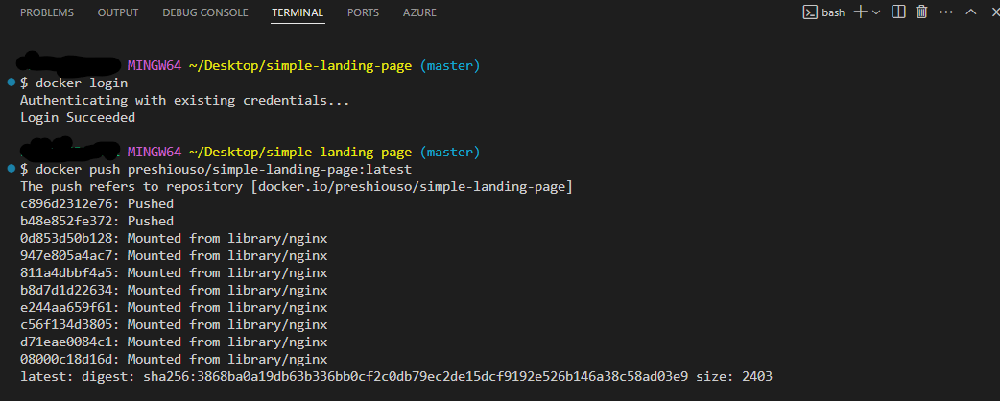
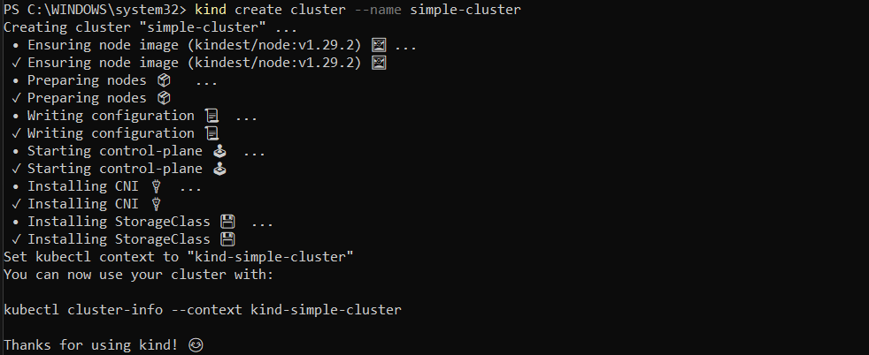

# 🚀 My Guide to Deploying a Simple Landing Page Using Docker & Kubernetes
1. Hypothetical Use Case
I was working on a simple static website (HTML and CSS) for a company’s landing page. The challenge was to containerize the application using Docker, deploy it to a Kubernetes cluster, and then expose it using Nginx. The goal was to make it accessible to anyone who wanted to visit it.

# 2. Tasks
### Task 1: Set Up My Project
First things first, I created a new project directory. Inside that, I created two important files:

- HTML file (index.html)

- CSS file (styles.css)


### Task 2: Initialize Git
Once the files were in place, I initialized a Git repository in my project directory to keep everything organized and under version control:

```bash
git init
```
Now my project was all set up with Git, and I was ready to start tracking my changes. 👍

### Task 3: Git Commit
I added my initial files to Git and committed them with this:

```bash
git add .
git commit -m "Initial commit: Add HTML and CSS for landing page"
```
At this point, my code was officially committed. 🚀

### Task 4: Dockerize the Application
I wanted to make sure my landing page was containerized so that it could run anywhere. To do that, I created a Dockerfile using Nginx as the base image. 
Then, I built my Docker image:

```basht
docker build -t preshiouso/simple-landing-page .
```

I now had a Docker image for my landing page ready to go! 🐳

### Task 5: Push to Docker Hub
I wanted to make my image available remotely, so I logged into Docker Hub and pushed my image:



### Task 6: Set Up a Kind Kubernetes Cluster
Next up, I set up a local Kubernetes cluster using Kind (Kubernetes in Docker). 



### Task 7: Deploy to Kubernetes
Now it was time to deploy my Dockerized landing page app to the Kubernetes cluster. I created a Kubernetes Deployment YAML file for it:


### Task 8: Create a Service (ClusterIP)
To make sure I could access my app, I created a Kubernetes Service:


Task 9: Access the Application
To see my app running locally, I used port-forwarding:


```bash
kubectl port-forward service/landing-page-service 8080:80
```
Opened my browser and visited http://localhost:8080.

I could now see my simple frontend landing page in action! 🌐