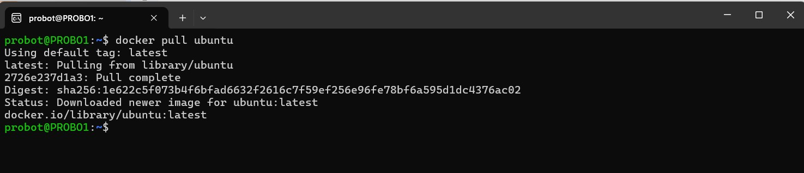
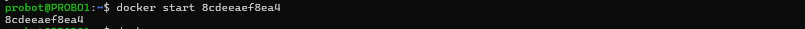
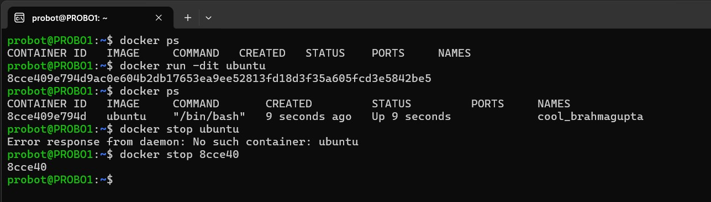

# 🚀 Personal Docker Guide: Launching and Managing Containers

This is a personalized guide I created while exploring Docker and learning how to launch containers using different options.

---

## 🧪 Running Containers with Custom Options

Docker gives us the ability to customize containers easily.
First I pulled the image from Docker Hub with;
``` bash
docker pull ubuntu
```


### ➕ Environment Variables

To pass environment variables into a container:

```bash
docker run -e MY_VARIABLE=my-value ubuntu env
```

This sets the `MY_VARIABLE` inside the Ubuntu container.

[Environment Variable Example](img/dckr-run-e.jpg)

---


## 🎛️ Running Containers in the Background

By default, Docker containers run in the **foreground**. To detach and run in the **background**, use the `-d` flag:

```bash
docker run -d ubuntu sleep 1000
```

This will run the container in the background for 1000 seconds.

[Detached Mode Screenshot](img/dckr-run-d.jpg)

---

## 🔄 Container Lifecycle Management

Containers follow a lifecycle:

- Create → Start → Stop → Restart → Remove

### ▶️ Start a Stopped Container

```bash
docker start <container_name_or_id>
```

### ⏹️ Stop a Running Container

```bash
docker stop <container_name_or_id>
```

### 🔁 Restart a Container

```bash
docker restart <container_name_or_id>
```
[Lifecycle Commands Screenshot](img/dckr-restart.jpg)

---

## 🧹 Removing Containers

To remove a container completely:

```bash
docker rm <container_name_or_id>
```

Tip: Make sure the container is stopped before removing it.

[Remove Container Screenshot](img/dckr-rm.jpg)

---

## ✅ Summary

| Task                  | Command Example                   |
| --------------------- | --------------------------------- |
| Run with Env Variable | `docker run -e MY_VAR=val ubuntu` |
| Run Detached          | `docker run -d ubuntu sleep 1000` |
| Start Container       | `docker start my-container`       |
| Stop Container        | `docker stop my-container`        |
| Restart Container     | `docker restart my-container`     |
| Remove Container      | `docker rm my-container`          |

---

This personalized doc helps me remember how to handle containers at every stage. 🔄

Would you like me to help generate or organize actual screenshots to match the image links above?

yes

i need the image links organised

