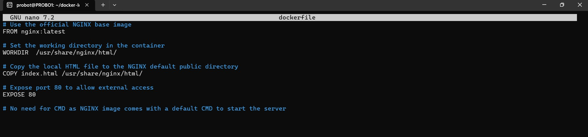
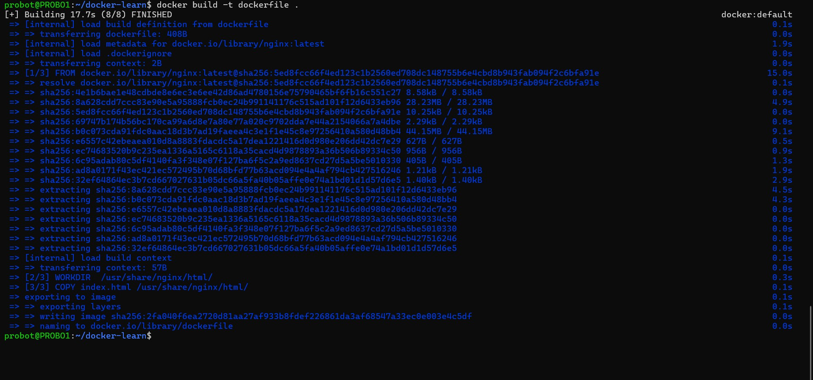
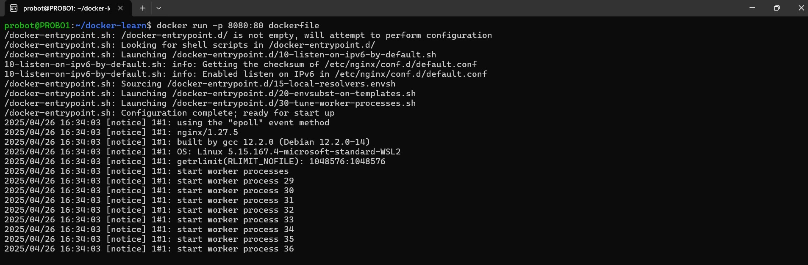
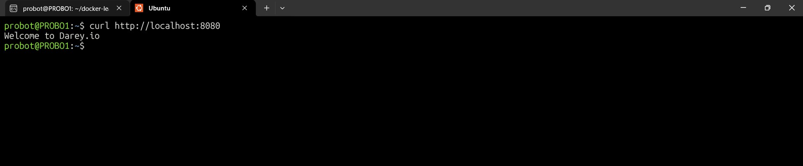
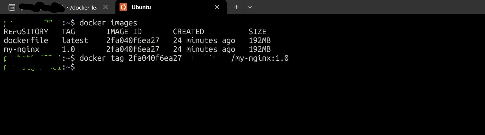
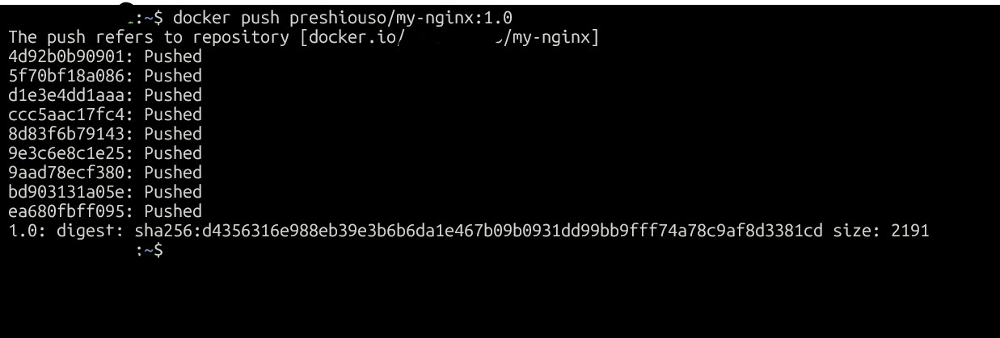
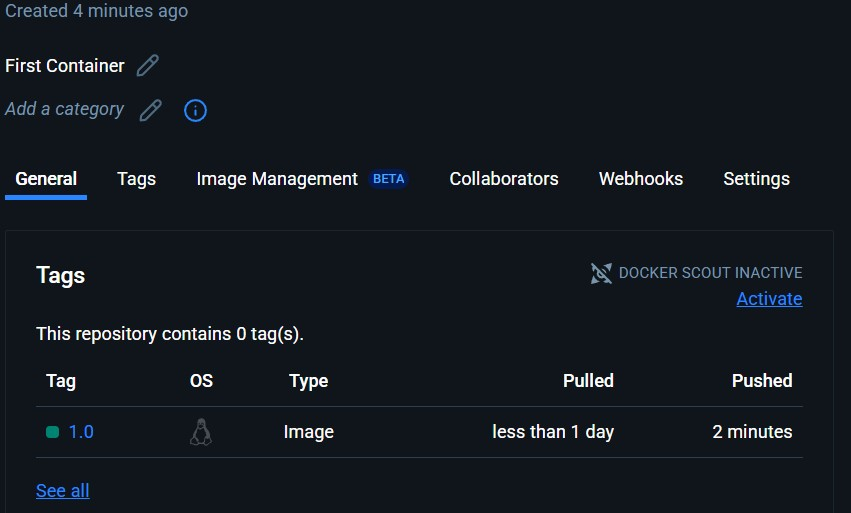

# Dockerized Static Web Page with Nginx

## Project Overview
In this project, I containerized a simple static web page using **Nginx** and **Docker**.  
The goal was to package an HTML page inside a Docker image, then serve it via an Nginx container.

---

## Step 1: Create a Dockerfile

I created a `Dockerfile` with the following steps:

- **Base Image**: Used the official `nginx` image.
- **Copy Web Files**: Copied my custom HTML file into Nginx's default directory.
- **Expose Port**: Exposed port `80` for web traffic.

**Dockerfile:**
```dockerfile
# Use official nginx image
FROM nginx:latest

# Copy static HTML file into Nginx web directory
COPY index.html /usr/share/nginx/html/index.html

# Expose port 80
EXPOSE 80
```


`

---

## Step 2: Build the Docker Image

After writing the Dockerfile, I built the Docker image.

**Commands:**
```bash
cd /path/to/dockerfile
docker build -t my-nginx-website .
```


---

## Step 3: Run the Docker Container

Once the image was built successfully, I ran a container:

**Command:**
```bash
docker run -d -p 8080:80 --name nginx-container my-nginx-website
```



---

## 4: Verify in Browser

To check if the setup was working:

1. I found the **public IP** of my server.
2. Opened a terminal and ran
``` bash
curl http://localhost:8080
```



---

## 5: Tagged the image


## 6: Pushed image to my repository
Pushed the image to my personal repository and verified.




