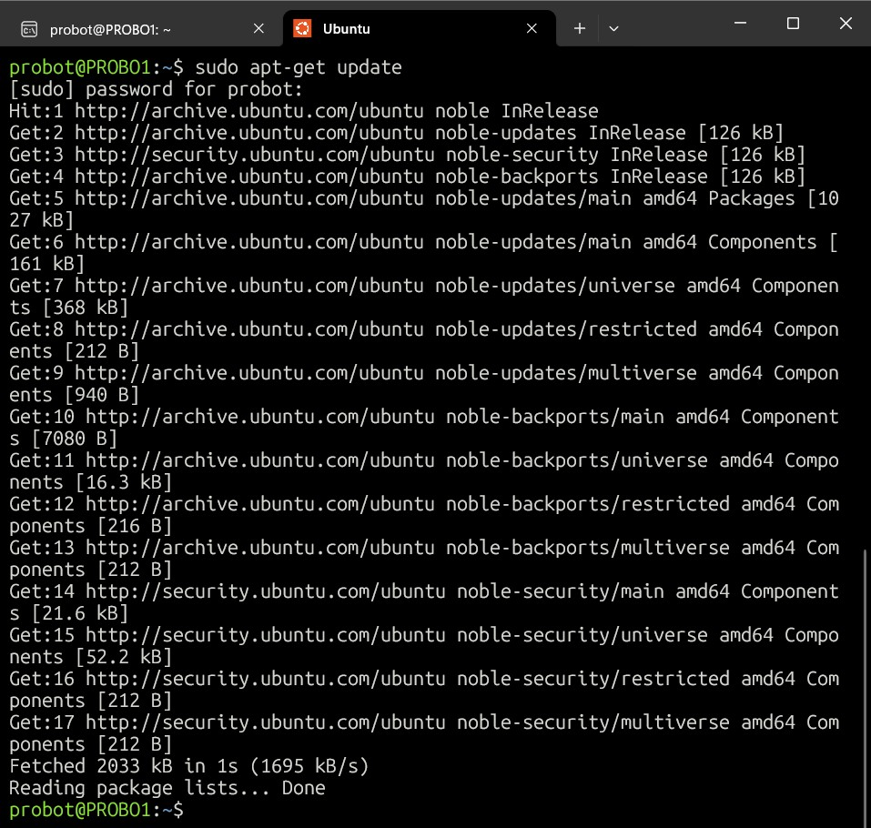
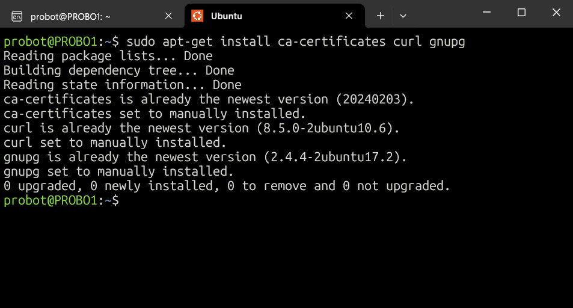
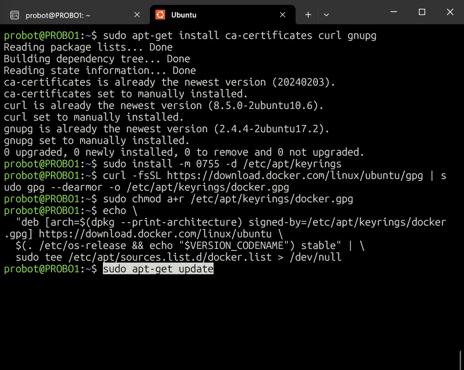
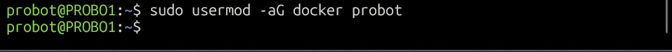
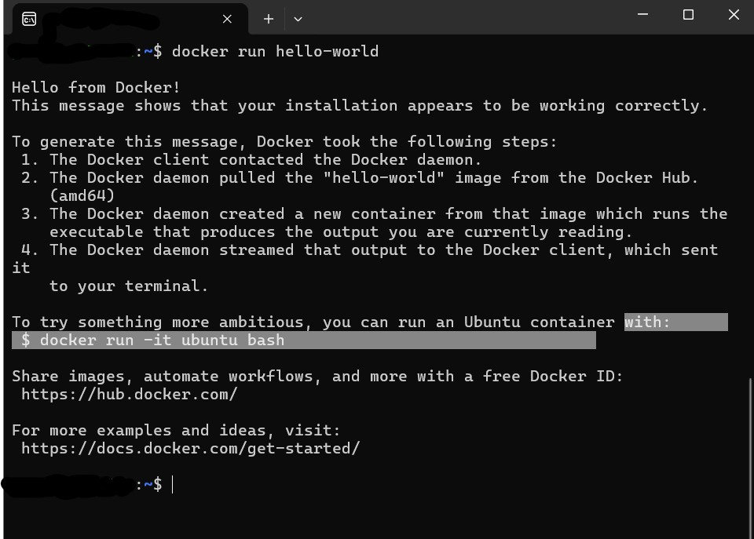
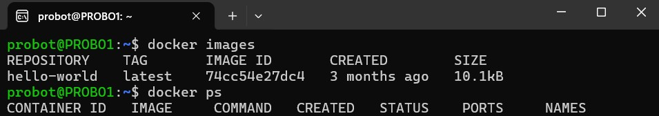

# 🐫 Docker Installation on Ubuntu — Step-by-Step Guide

This document captures my full process of installing Docker on an Ubuntu machine, verifying the setup, and running a test container.

---

## 📦 Step 1: Update the System

First, I made sure my package list was updated.

```bash
sudo apt-get update
```

> 

---

## 🔒 Step 2: Install Required Packages

Installed essential certificates and tools needed for Docker installation.

```bash
sudo apt-get install ca-certificates curl gnupg
```

> 

---

## 🗁️ Step 3: Add Docker’s Official GPG Key

Created a directory for keyrings and downloaded Docker's GPG key:

```bash
sudo install -m 0755 -d /etc/apt/keyrings
curl -fsSL https://download.docker.com/linux/ubuntu/gpg | sudo gpg --dearmor -o /etc/apt/keyrings/docker.gpg
sudo chmod a+r /etc/apt/keyrings/docker.gpg
```

> 

---

## 🗂️ Step 4: Set Up the Docker Repository

Added Docker’s repository to APT sources:

```bash
echo \
  "deb [arch=$(dpkg --print-architecture) signed-by=/etc/apt/keyrings/docker.gpg] https://download.docker.com/linux/ubuntu \
  $(. /etc/os-release && echo "$VERSION_CODENAME") stable" | \
  sudo tee /etc/apt/sources.list.d/docker.list > /dev/null
```

> 

---

## 🔄 Step 5: Update APT Sources Again

Updated the package list after adding Docker’s repository:

```bash
sudo apt-get update
```

---

## 🚰 Step 6: Install Docker Engine and Plugins

Installed Docker Engine and related tools:

```bash
sudo apt-get install docker-ce docker-ce-cli containerd.io docker-buildx-plugin docker-compose-plugin
```

---

## 📈 Step 7: Verify Docker Service

Checked if Docker was running successfully:

```bash
sudo systemctl status docker
```

> 

---

## 👤 Step 8: Manage Docker as a Non-Root User

I added my user to the Docker group to run Docker commands without `sudo`:

```bash
sudo usermod -aG docker ubuntu
```

*(Note: If the user is different, replace `ubuntu` with your current username.)*

**Important:** I logged out and logged back in for group changes to take effect.



---

## 🚀 Step 9: Test Docker Installation

Ran the official "Hello World" container to test the setup:

```bash
docker run hello-world
```

> 

---

## 🧹 Step 10: Additional Docker Commands

- **List downloaded images:**
  ```bash
  docker images
  ```

- **List running containers:**
  ```bash
  docker ps
  ```

- **Remove a Docker image:**
  ```bash
  docker rmi IMAGE_ID
  ```

> 

---

# ✅ Conclusion

Docker was successfully installed and tested!  
Now I can start running and building containerized applications on my server. 🐫🚀

---

