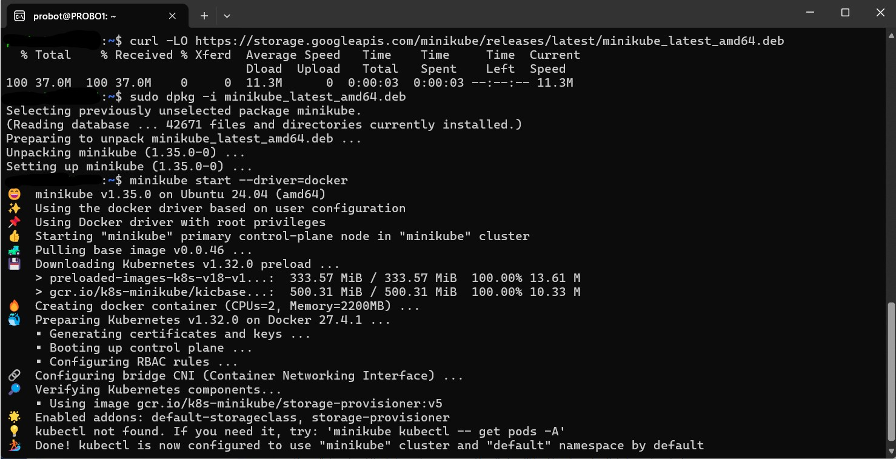
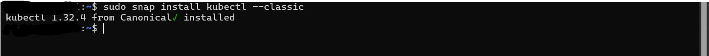
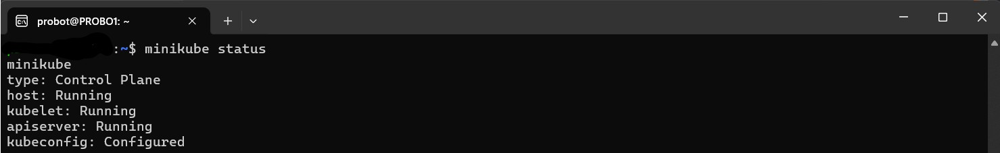
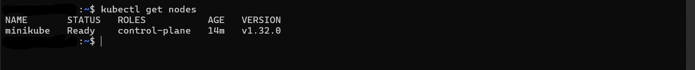

# Installing Minikube on Linux

This document outlines the steps, commands, and insights gained while installing Minikube on a Linux system.

---

## 📋 Prerequisites

- A system with a supported Linux distribution (e.g., Ubuntu, Debian, CentOS)
- 2 CPUs or more
- 2GB of free memory
- 20GB of disk space
- Virtualization support (VMX or SVM enabled in BIOS)

---

## 🧰 Required Tools

- `curl` or `wget`
- A hypervisor (e.g., VirtualBox, KVM, or Docker)
- `kubectl` (Kubernetes command-line tool)

---


# 🐳 Installing Minikube on Linux (Using .deb Package)

This guide documents the steps used to install Minikube and `kubectl` on a Linux system using the `.deb` package method and Docker as the driver.

---

## 📦 1. Download and Install Minikube

Download the latest `.deb` installer for Minikube:

```bash
curl -LO https://storage.googleapis.com/minikube/releases/latest/minikube_latest_amd64.deb
```
## Install the package:

```bash
sudo dpkg -i minikube_latest_amd64.deb
```

## 🚀 2. Start Minikube with Docker Driver
```bash
minikube start --driver=docker
```
⚠️  Ensure Docker is installed and running. You may need to add your user to the Docker group if permissions issues occur:

```bash
sudo usermod -aG docker $USER
newgrp docker
```
## 🛠 3. Install kubectl via Snap
```bash
sudo snap install kubectl --classic
```

## ✅ 4. Post-Installation Verification
Check Minikube status:

```bash
minikube status
```

Verify Kubernetes cluster nodes:

```bash
kubectl get nodes
```
