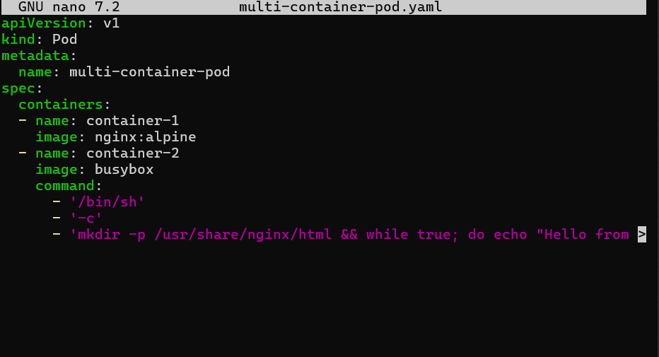
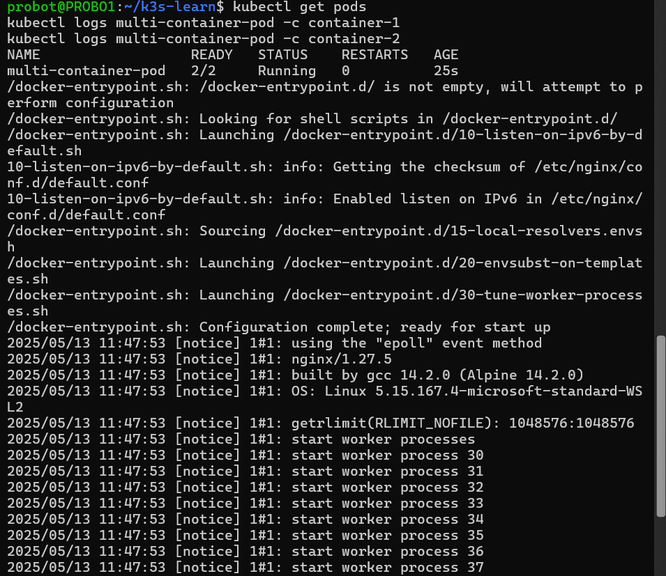
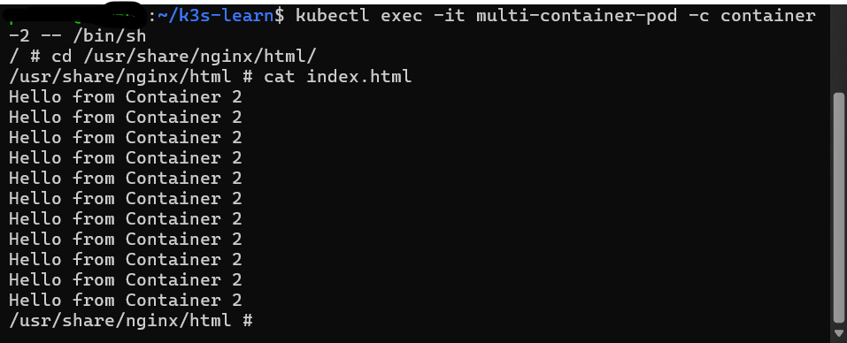

# Multi-Container Pod Example Project

This project demonstrates how to create and manage a multi-container pod in Kubernetes. The pod consists of two containers: a **Nginx** web server and a **BusyBox** container for testing and accessing the Nginx service.

## Step 1: Create the Multi-Container Pod YAML File

Create a file called `multi-container-pod.yaml` with the following contents:

```yaml
apiVersion: v1
kind: Pod
metadata:
  name: multi-container-pod
spec:
  containers:
  - name: container-1
    image: nginx:latest
    ports:
    - containerPort: 80
  - name: container-2
    image: busybox
    command: ["sleep", "10"]
```
This YAML file creates a pod with two containers:

- container-1: Runs an Nginx web server, exposing port 80.

- container-2: Runs a BusyBox container that sleeps for 3600 seconds (1 hour), allowing us to interact with the pod.



## Step 2: Apply the Pod Configuration
To create the pod in Kubernetes cluster, I used the following commands:

``` bash
kubectl apply -f multi-container-pod.yaml
```
This will create the multi-container pod according to the specified configuration in the YAML file.


## Step 3: Check Pod Status and Logs
To check the status of the pod, I ran the following commands:

``` bash
kubectl get pods
```

#### Viewing Logs for the Nginx Container
To view logs from the Nginx container, I ran the following commands:

```bash
kubectl logs multi-container-pod -c container-1
```
#### Viewing Logs for the BusyBox Container
To view logs from the BusyBox container, I ran the following commands::

``` bash
kubectl logs multi-container-pod -c container-2
```



## Step 4: Access Nginx from the BusyBox Container
To access the Nginx server running in container-1 from container-2 (BusyBox),I executed the following command to get a shell inside the BusyBox container:

```bash
kubectl exec -it multi-container-pod -c container-2 /bin/sh
```
Once inside the BusyBox container's shell, I navigated to the nginx directory:

```sh
cd /usr/share/nginx/html
cat index.html
```


## Conclusion
In this project, I created a multi-container pod in Kubernetes with two containers: one running Nginx and the other running BusyBox. I also learned how to apply the configuration, check the pod status, view logs, and interact with the containers inside the pod.