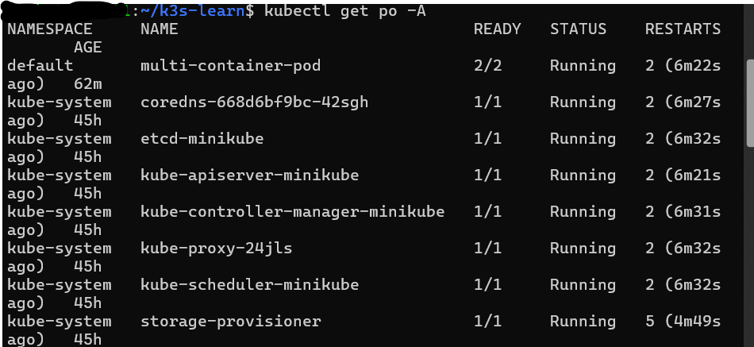
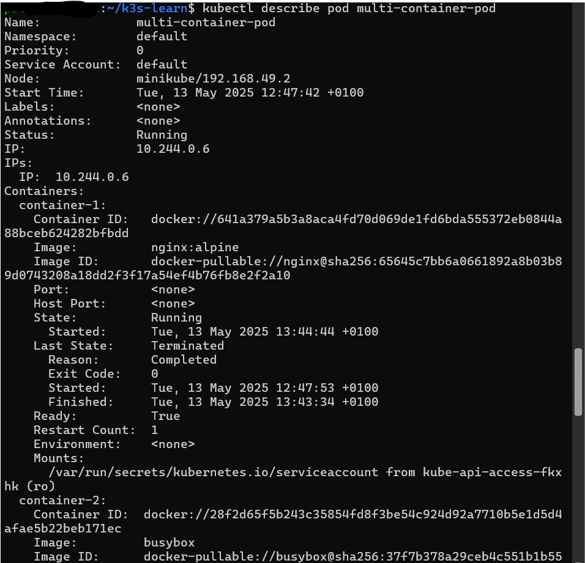
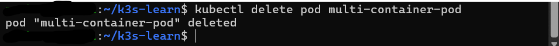

# 📘 Personal Notes: Kubernetes Pod Management

This document summarizes the practical knowledge I've gained while learning to create and manage Pods in Kubernetes. These are foundational skills for any Kubernetes user or developer.

---

## 🚀 Creating and Managing Pods

One of the first steps in Kubernetes is understanding how to **define and run a Pod**. A Pod is the smallest and simplest unit in the Kubernetes object model.

I learned to define a Pod using a YAML configuration file. Example:

```yaml
apiVersion: v1
kind: Pod
metadata:
  name: my-sample-pod
spec:
  containers:
  - name: my-container
    image: nginx
```
This file defines a pod with a single container running the nginx image. Using kubectl apply -f <filename>.yaml, I was able to create and deploy it in my cluster.

## 📋 Listing Pods
After deploying Pods, I used the following command to list all Pods running in the current namespace:

```bash
kubectl get pods
```

This command provides a quick overview, including the Pod names, statuses, restarts, and age. It's my go-to for checking what's currently active in the cluster.

## 🔍 Inspecting a Pod
To get more detailed information about a specific Pod, I used:

```bash
kubectl describe pod <pod-name>
```

This command gives in-depth details like:

- Events and conditions (e.g., scheduled, pulled image, started)

- Node it's running on

- Container statuses and resource usage

- Environment variables and volume mounts

Understanding this helped me debug and verify my pod configurations more effectively.

## 🗑️ Deleting a Pod
When a Pod is no longer needed (or needs to be recreated), I used this command:

```bash
kubectl delete pod <pod-name>
```

This permanently removes the Pod from the cluster. I learned that if the Pod is managed by a Deployment, it will be recreated automatically. But standalone Pods are gone unless I manually reapply the YAML.

## 🧠 Key Takeaways
Pods are ephemeral and can be created easily from YAML files.

kubectl get pods helps track running workloads.

kubectl describe pod is a powerful diagnostic tool.

Deleting Pods is straightforward but should be done carefully if they're not managed by controllers (e.g., Deployments).

