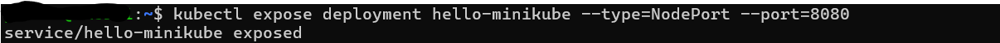

# Deploying Applications & YAML Basics

This document summarizes my hands-on experience with deploying applications in Kubernetes using `kubectl` commands and YAML manifests.

---

## 🚀 Deploying Applications in Kubernetes

### ✅ Command Used:
```bash
kubectl create deployment hello-minikube --image=kicbase/echo-server:1.0
```

### 🔍 What I Learned:
- This command creates a Deployment named hello-minikube.

- It uses the container image kicbase/echo-server:1.0, which responds to HTTP requests with request info.

- Kubernetes Deployments manage the rollout, scaling, and self-healing of application instances.

### 🌐 Exposing a Deployment as a Service
``` bash
kubectl expose deployment hello-minikube --type=NodePort --port=8080
```


### 🔍 What I Learned:
- This exposes the deployment using a NodePort service, which allows external access to the application on port 8080.

- NodePort is great for development and local testing with Minikube.

### 📦 Viewing Services
``` bash
kubectl get services hello-minikube
```


### 🔍 What I Learned:
- This displays the status and cluster IP of the service.

- It's helpful to confirm the exposure and port mapping of your services.

## 📝 Working With YAML Files
### 🔧 Step 1: Create Deployment YAML
I created a new file named nginx-deployment.yaml:
``` yaml
apiVersion: apps/v1
kind: Deployment
metadata:
  name: my-nginx-deployment
spec:
  replicas: 1
  selector:
    matchLabels:
      app: my-nginx
  template:
    metadata:
      labels:
        app: my-nginx
    spec:
      containers:
      - name: my-nginx
        image: dareyregistry/my-nginx:1.0
        ports:
        - containerPort: 80

```


### 🔧 Step 2: Create Service YAML
I created another file named nginx-service.yaml:
``` yaml
apiVersion: v1
kind: Service
metadata:
  name: my-nginx-service
spec:
  selector:
    app: my-nginx
  ports:
    - protocol: TCP
      port: 80
      targetPort: 80
  type: NodePort

```


### ✅ Commands Used:
``` bash
kubectl apply -f nginx-deployment.yaml
kubectl apply -f nginx-service.yaml
```


- This created both the deployment and service based on the configuration files.

- It taught me how to define infrastructure as code using declarative manifests.

## 🔍 Verifying Resources
### ✅ Commands Used:
``` bash
kubectl get deployments
kubectl get services
```

- Lists all running deployments and services, respectively.

- Useful for checking that resources have been successfully created and are healthy.

## 🌐 Accessing Services in Minikube
### ✅ Command Used:
``` bash
minikube service my-nginx-service --url
```


- This command gives the external URL to access the service running in the Minikube cluster.

- Super helpful when testing services locally.