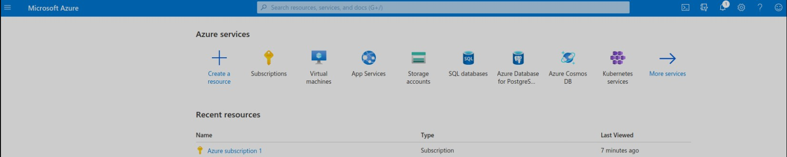

# Azure Virtual Machines: Hands-On Project

This guide summarizes the key steps and learnings from setting up and managing **Azure Virtual Machines (VMs)**, covering account creation, VM deployment, configuration, and management.

  


---

## Part 1: Azure Setup

### 1. Create an Azure Account
- Signed up for a **free Azure account** [here](https://azure.microsoft.com/en-us/free/).  
- **Note**: Free tier includes limited credits; pay-as-you-go for extended use.

### 2. Access Azure Portal
- Logged in to the [Azure Portal](https://portal.azure.com) using the new account.  
- **Portal Features**: Dashboard, resource groups, and service management.

---

## Part 2: Azure Virtual Machines

### 3. Create a Resource Group
- Navigated to **Resource Groups > Create**.  
- Named the group (e.g., `Project-VMs`) and selected a **region** (e.g., East US).  
- **Purpose**: Organize related resources (VMs, disks, networks) for easier management.

### 4. Create a Virtual Machine
- Selected **Virtual Machines > Create VM**.  
- **Key Configurations**:  
  - **OS**: Chose between Windows Server 2022 or Ubuntu 20.04 LTS.  
  - **VM Size**: Selected `B2s` (2 vCPUs, 4 GiB RAM) for cost efficiency.  
  - **Authentication**:  
    - **Windows**: Username/password for RDP.  
    - **Linux**: SSH key pair (`id_rsa.pub` uploaded).  
  - **Networking**: Allowed default settings (Azure creates a VNet and public IP).  
- **Disk Type**: Used **Standard SSD** for balanced performance/cost.

### 5. Connect to the VM
- **Windows VM**:  
  - Downloaded the RDP file from the Azure Portal.  
  - Connected via **Remote Desktop Protocol (RDP)** using the VM’s credentials.  
- **Linux VM**:  
  - Used SSH from terminal:  
    ```bash
    ssh -i ~/.ssh/id_rsa azureuser@<VM_Public_IP>
    ```

### 6. Explore VM Configuration
- **OS Options**: Compared Windows Server vs. Linux flavors (e.g., Ubuntu, CentOS).  
- **Disk Types**:  
  - **Premium SSD**: High-performance for production workloads.  
  - **Standard HDD**: Cost-effective for backups.  
- **Networking**: Reviewed inbound/outbound rules in the **Network Security Group (NSG)**.

---

## Part 3: VM Management

### 7. Start/Stop VM
- **Stopping**: Navigated to **VM > Stop** to deallocate resources (avoids billing for compute).  
- **Starting**: Restarted the VM via the portal; observed boot time changes.  

### 8. Resize VM
- **Steps**:  
  1. Stopped the VM.  
  2. Selected **Size > Changed to `B4ms` (4 vCPUs, 16 GiB RAM)**.  
  3. Restarted the VM.  
- **Use Case**: Scaling up for higher workloads or down to save costs.

---

## Key Learnings

### 1. Resource Groups
- **Purpose**: Logical containers for managing related Azure resources.  
- **Best Practice**: Group resources by project/environment (e.g., `Dev-VMs`, `Prod-Databases`).

### 2. VM Configuration Tradeoffs
- **Cost vs. Performance**: Smaller sizes (e.g., `B2s`) save costs but limit performance.  
- **Authentication**: SSH keys (Linux) are more secure than passwords for RDP (Windows).  

### 3. Disk Types
- **SSD vs. HDD**: SSDs offer better IOPS for active workloads; HDDs suit archival data.  

### 4. Flexible Scaling
- **Vertical Scaling (Resizing)**: Adjust VM sizes to match workload demands.  
- **Auto-Shutdown**: Schedule VMs to stop overnight to reduce costs.  

---

## Project Reflection
This project demonstrated Azure’s flexibility in deploying and managing VMs. Key takeaways:  
- **Resource organization** is critical for multi-service projects.  
- **Right-sizing VMs** balances performance and budget.  
- **Security** (SSH keys) must be prioritized from the start.  


