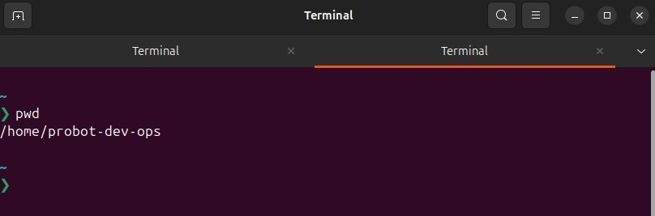
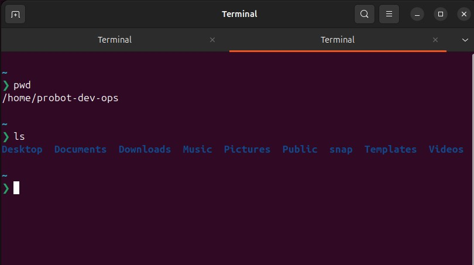
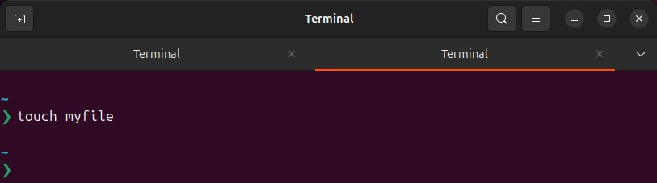
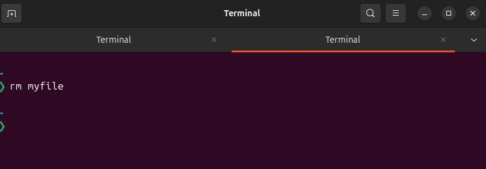
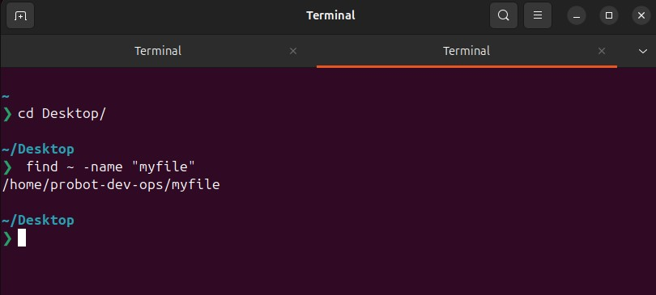
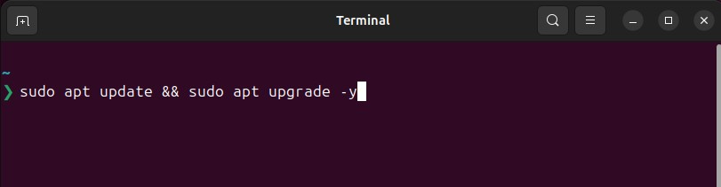

# 🐧 Linux Command Line Mastery: File & Directory Management

## 📌 Introduction
Learning **Linux commands** for managing files and directories has been an insightful experience. These commands are essential for navigating the system efficiently, modifying files, and handling permissions. Below is a summary of key commands and lessons learned.

---

## 📂 1. Navigating the Filesystem with `pwd` & `ls`
- **`pwd` (Print Working Directory):**  
  Displays the current directory.
  ```sh
  pwd
  ```

  📌 *Key Learning*: This helps confirm the exact location in the system before executing commands.

- **`ls` (List Directory Contents):**  
  Lists files and directories in the current location.
  ```sh
  ls  # Lists names only
  ls -l  # Detailed view with permissions, owner, size, and date
  ls -a  # Shows hidden files (starting with `.`)
  ```
  📌 *Key Learning*: Using different flags (`-l`, `-a`, etc.) gives more control over file listing.

---

## 🛠 2. Creating and Removing Files with `touch` & `rm`
- **`touch` (Create a New File):**  
  Creates an empty file or updates its timestamp.
  ```sh
  touch myfile.txt
  ```
  
  📌 *Key Learning*: Useful for quickly creating new files without opening an editor.

- **`rm` (Remove/Delete a File):**  
  Deletes a file permanently.
  ```sh
  rm myfile.txt  # Delete a single file
  rm -r mydir/   # Recursively delete a directory and its contents
  rm -i file.txt  # Asks for confirmation before deletion
  ```
  📌 *Key Learning*: **Be cautious!** Once deleted, files **cannot be recovered** unless backed up.

---

## 📁 3. Searching for Files with `find`
- **`find` (Locate Files and Directories):**  
  Searches for files based on name, type, or modification date.
  ```sh
  find /home -name "document.txt"  # Find a file named document.txt in /home
  find . -type d  # List all directories in the current path
  find /var/log -mtime -3  # Find files modified in the last 3 days
  ```
  
  📌 *Key Learning*: `find` is a **powerful tool** for tracking down misplaced files.

---

## 🔒 4. Running Commands as Superuser with `sudo`
- **`sudo` (Superuser Do):**  
  Runs commands with administrative privileges.
  ```sh
  sudo apt update  # Update system packages (Debian-based)
  sudo yum install nano  # Install nano editor (Red Hat-based)
  ```
  
  📌 *Key Learning*: Use **sudo** only when necessary to avoid accidental system modifications.

---

## 🎯 Conclusion
Mastering these **basic Linux commands** has greatly improved my ability to navigate, manipulate files, and manage permissions effectively. These skills are **essential for system administration, scripting, and daily Linux usage**. 🚀

