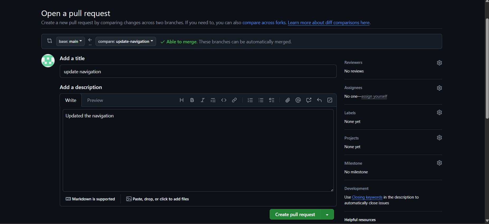
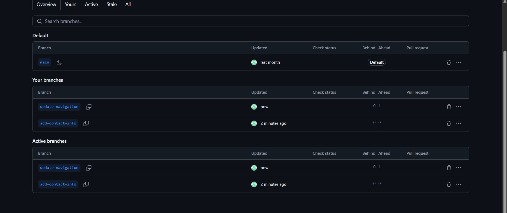
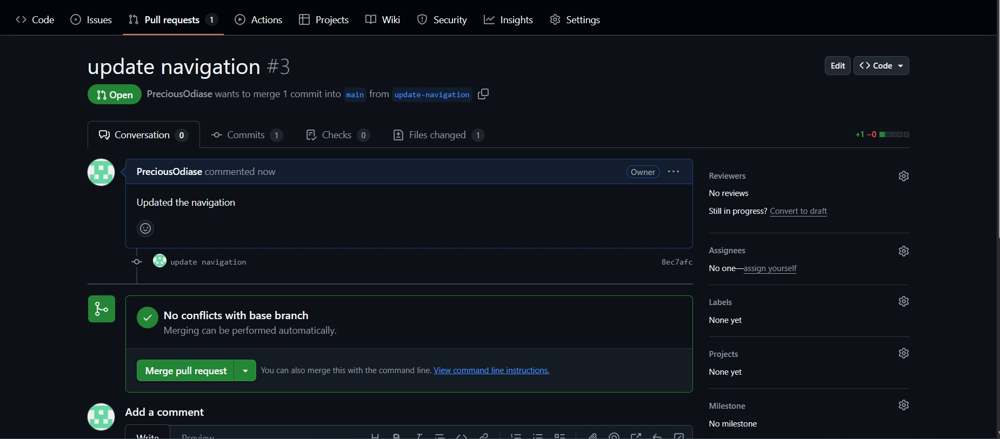

# Git Branching and Merging

This file documents the knowledge and experience I gained from learning and practicing **Git branching and merging**. These are fundamental concepts for collaborative development and effective version control.

---

## Creating a Pull Request

After making changes in a separate branch (e.g., `feature/login-page`), I learned how to open a **pull request (PR)** on GitHub. A pull request is a way to propose code changes and initiate discussions before merging them into the main branch.

### Steps I Followed:
1. Created a new branch locally and pushed it to GitHub.
2. On GitHub, I clicked **"Compare & Pull Request"** after pushing.
3. Added a descriptive title and summary explaining the changes.
4. Submitted the pull request for review.

---

## Merging the Pull Request into the Main Branch

After the pull request was reviewed and approved (or self-reviewed for personal projects), I merged it into the `main` branch. This integrates the feature or bug fix into the production-ready code.

### Merge Methods:
- **Merge Commit**: Keeps all commit history intact.
- **Squash & Merge**: Combines all commits into a single one for cleaner history.
- **Rebase & Merge**: Rewrites commit history to make it linear.

### Steps I Followed:
1. Clicked **"Merge pull request"** on GitHub.
2. Chose the preferred merging option.
3. Deleted the feature branch after merging (optional but recommended).

📷 Screenshot of Merging a Pull Request:  

---

## Reflections

- I now understand the importance of branches in isolating changes and keeping the main codebase stable.
- Pull requests serve as a checkpoint for code quality and collaboration.
- Merging strategies help maintain a clean and understandable commit history.

---

🧠 Knowledge Gained:
- How to create and switch Git branches locally.
- Pushing branches and opening pull requests on GitHub.
- Performing merges using GitHub’s interface.
- Cleaning up by deleting merged branches.

