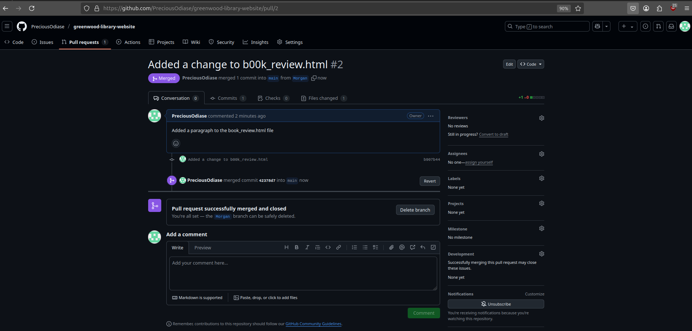

# Git Version Control Basics

## Introduction
Git is a distributed version control system that enables teams and individuals to track changes in source code during software development. It allows for efficient collaboration and maintains a detailed history of a project's evolution.

---

## Git Installation
- **Windows**: Install via [Git for Windows](https://git-scm.com/download/win)
- **MacOS**: Use Homebrew: `brew install git`
- **Linux**: Use package manager: `sudo apt install git` or `sudo yum install git`

---

## Git Configuration
```bash
git config --global user.name "Your Name"
git config --global user.email "you@example.com"
```
Check configuration:

```bash
git config --list
```
## Common Git Commands
### Repository Initialization
```bash
git init
```
Initializes a new Git repository.

### Cloning a Repository
```bash
git clone <repository-url>
```
Creates a copy of a remote repository locally.

### Checking Repository Status
```bash
git status
```
### Tracking Files
```bash
git add <filename>      # Add a single file
git add .               # Add all files
```


### Committing Changes
```bash
git commit -m "Commit message"
```


### Viewing History
```bash
git log
```
## Branching and Merging
### Creating and Switching Branches
```bash
git branch <branch-name>
git checkout <branch-name>
git checkout -b <new-branch-name>  # Create and switch
```
### Merging Branches
```bash
git merge <branch-name>
```
### Deleting a Branch
```bash
git branch -d <branch-name>
```
## Working with Remote Repositories
### Adding a Remote
```bash
git remote add origin <url>
```
### Fetching and Pulling Changes
```bash
git fetch
git pull
```


### Pushing Changes
```bash
git push origin <branch-name>
```

