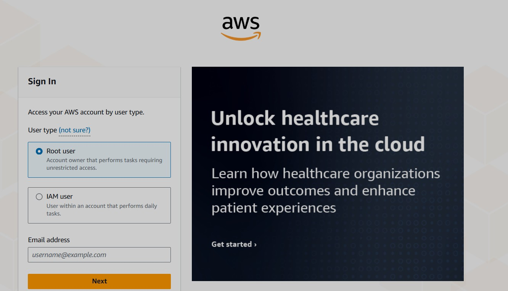
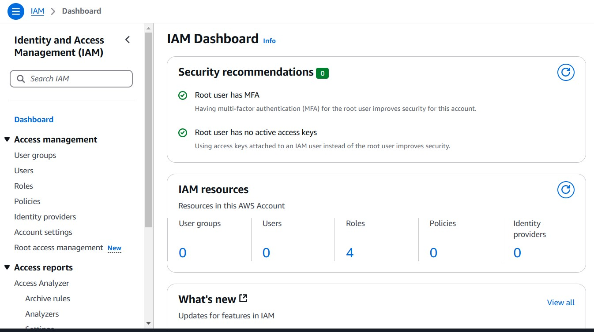

# Introduction to Cloud Computing — Security & Identity

## Overview

This project explores **Identity and Access Management (IAM)** within Amazon Web Services (AWS). The focus was on configuring secure access, managing permissions, and applying best practices for user and group management through hands-on tasks.

---

## 1. Management (IAM) and Project Setup

### 1.1 Log in to the AWS Management Console
Use an administrator account to log into the AWS Console.



### 1.2 Navigate to the IAM Dashboard
The **IAM Dashboard** is the central place for managing AWS identities including users, roles, groups, and policies.



---

## 2. Exercises

### 2.1 Creating IAM Users
Created individual users with unique credentials and permissions based on job roles.

### 2.2 Create Policy for the Development Team
Defined a custom IAM policy granting appropriate permissions for development-related tasks.

```json
{
  "Version": "2012-10-17",
  "Statement": [
    {
      "Effect": "Allow",
      "Action": [
        "ec2:*",
        "s3:ListBucket",
        "s3:GetObject"
      ],
      "Resource": "*"
    }
  ]
}

### 2.3 Create Group for the Data Analysts Team
Created a group called DataAnalysts and assigned policies related to data access and analytics tools like Amazon Athena and S3.

### 2.4 Testing and Validation
Testing John's Access: Verified John (backend developer) had access only to backend services.

Implement Multi-Factor Authentication (MFA): Enabled MFA to strengthen account security.


## 3. Core Knowledge and Concepts
### 3.1 Role of IAM in AWS
IAM allows administrators to securely manage access to AWS services and resources. It ensures that the right people have the right access under the right conditions.

IAM helps enforce security, accountability, and efficient resource management in cloud environments.

### 3.2 IAM Users vs Groups
IAM Users: Individual identities for people or services.

Example: john.dev@example.com for a developer.

IAM Groups: A collection of users managed as a unit.

Example: DataAnalysts group with shared read-only access to S3 datasets.


### 3.3 Creating IAM Policies
Steps:

Define required permissions.

Write a JSON policy.

Attach it to a user, group, or role.

Use AWS Policy Generator or Visual Editor for ease.

### 3.4 Principle of Least Privilege
Grant users only the permissions they need to perform their job—nothing more.

This minimizes potential damage from accidental or malicious activity.

## 4. Scenario Reflection: John and Mary
John — Backend Developer
User: john.dev

Group: Developers

Policy: Full access to EC2 and limited access to S3

Mary — Data Analyst
User: mary.analyst

Group: DataAnalysts

Policy: Read-only access to S3, Athena, and Redshift

These configurations align with the principle of least privilege, ensuring each user has tailored access based on role.

## 5. Final Thoughts
Through this project, I gained a solid understanding of:

How IAM is foundational to cloud security.

Best practices for user, group, and policy management.

Real-world scenarios involving access control and multi-factor authentication.

Cloud security is not just about firewalls—it's about identity, access, and accountability.

Resources
