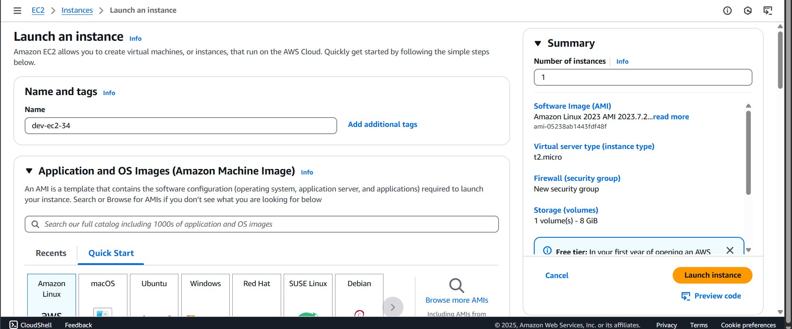
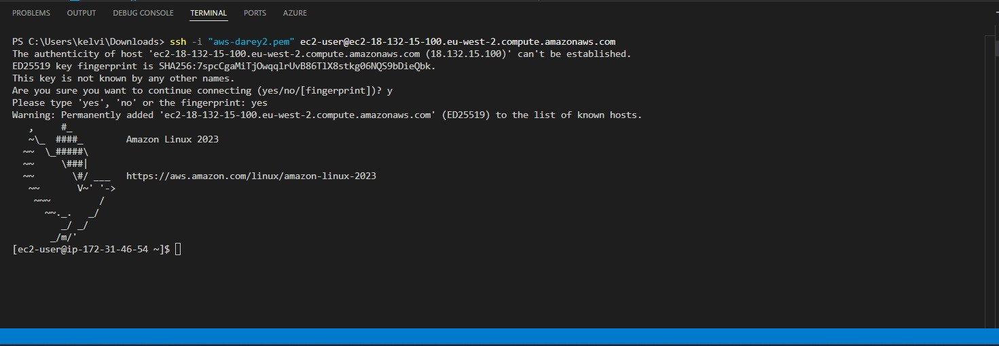
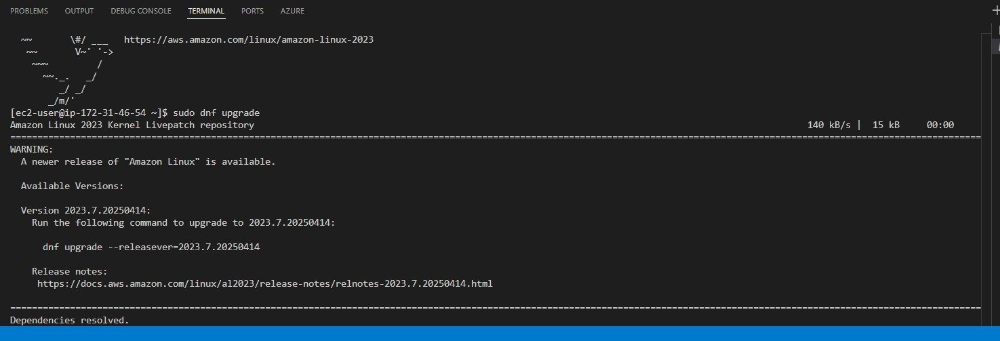
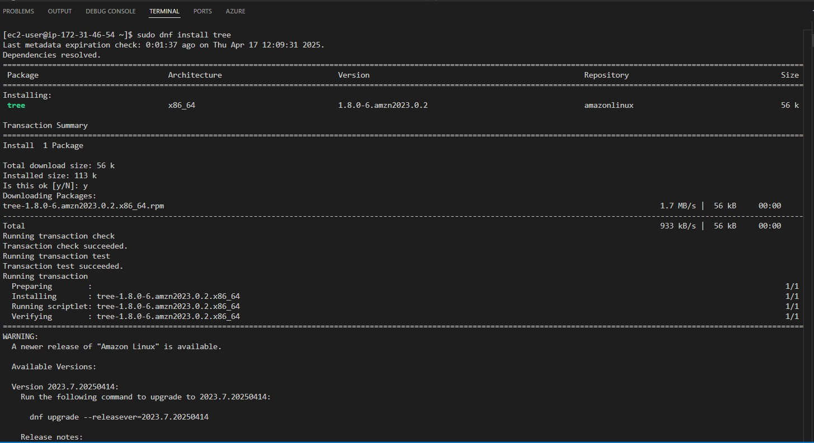
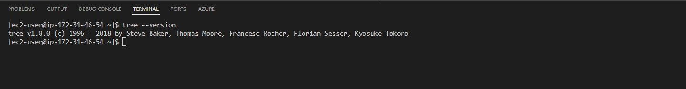

# 🐧 Linux Learning & EC2 Instance Management

## 📌 Understanding Linux Distributions
Through my learning journey, I explored various **Linux distributions (distros)** and their unique features. Here are some key takeaways:

- **Ubuntu**: Beginner-friendly, widely used for servers and desktops.
- **CentOS**: Stable and secure, preferred in enterprise environments.
- **Debian**: Highly stable with strong community support.
- **Amazon Linux**: Optimized for AWS, lightweight, and secure.

Each distro has its **own package manager**:
- `apt` for Debian-based distros (Ubuntu, Debian)
- `yum` or `dnf` for Red Hat-based distros (CentOS, Amazon Linux)

---

## 🔐 SSH into an EC2 Instance Running Linux
To connect to my **EC2 instance**, I followed these steps:

### 1️⃣ Launching an EC2 Instance
- Created an **Amazon Linux 2** EC2 instance on AWS.
- Configured **security groups** to allow SSH (`port 22`).

### 2️⃣ Connecting via SSH
Used the following command to SSH into my instance:
```sh
ssh -i my-key.pem ec2-user@<EC2_PUBLIC_IP>
```
📌 **Key Learnings**:
- **The `-i` flag** specifies the private key to authenticate.
- **Ensure key permissions**: If I got a *"bad permissions"* error, running:
  ```sh
  chmod 400 my-key.pem
  ```


---

## 🔄 Updating the Linux Machine
Once logged in, I updated the system:

- **For Amazon Linux / CentOS**:
  ```sh
  sudo yum update -y
  ```

- **For Ubuntu/Debian-based distros**:
  ```sh
  sudo apt update && sudo apt upgrade -y
  ```

📌 **Key Insights**:
- `update` fetches the latest package lists.
- `upgrade` installs the newest versions of installed packages.



---

## 📦 Installing Packages (Example: `tree`)
To enhance my system, I installed the **`tree`** package:

- **Amazon Linux / CentOS**:
  ```sh
  sudo yum install tree -y
  ```

- **Ubuntu/Debian**:
  ```sh
  sudo apt install tree -y
  ```


Then, I verified the installation:
```sh
tree --version
```


📌 **Takeaways**:
- Using `-y` avoids confirmation prompts.
- Package managers differ across distros.

---

## 🎯 Conclusion
- **Understanding different Linux distributions** helped me choose the right OS for the task.
- **SSHing into an EC2 instance** taught me authentication best practices.
- **Updating and installing packages** enhanced my system's functionality.

This hands-on experience strengthened my **Linux administration and cloud management** skills. 🚀

