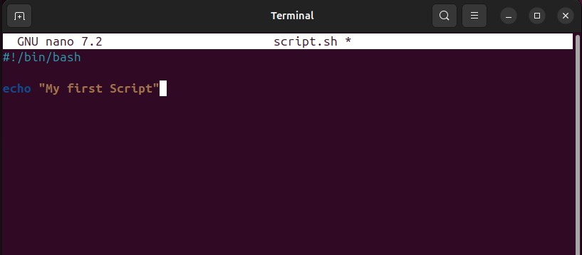

# 🖥️ Shell Scripting in Linux

## 📌 Introduction
Shell scripting allows users to automate repetitive tasks and execute multiple commands in sequence. It is an essential skill for **system administration, DevOps, and software development**.

---

## 📜 1. What is Shell Scripting?
A **shell script** is a file containing a series of **shell commands** that are executed sequentially. Shell scripts are commonly used for **automation, backups, system monitoring, and task scheduling**.

To create and run a shell script, follow these steps:

---

## 📂 2. Creating a Shell Scripting Directory on an Ubuntu Server
To keep things organized, I created a directory for shell scripts:
```sh
mkdir shell-scripting
cd shell-scripting  # Navigate into the directory
```

To confirm the directory was created:
```sh
ls -l
```

---

## ✍️ 3. Creating and Writing a Shell Script
Using the **VIM editor**, I created a file named `my_first_shell_script.sh`:
```sh
vim my_first_shell_script.sh
```

Inside this file, I added the following script:
```sh
#!/bin/bash
# My First Shell Script

echo "Hello, this is my first shell script!"
```


### 💾 Saving the File in VIM
After writing the script in VIM:
1. Press `Esc` to enter Normal Mode.
2. Type `:wq` and press `Enter` to **save and exit**.

To confirm the file is created:
```sh
ls -l
```

---

## 🔑 4. Understanding Important Shell Scripting Concepts

### 🏷 What Is a Shebang (`#!/bin/bash`)?
The **shebang (`#!`)** at the beginning of a script tells the system which **interpreter** to use. In this case:
```sh
#!/bin/bash
```
This specifies that **Bash** should execute the script.

### 📌 Variable Declaration and Initialization
In shell scripting, variables store values for reuse.

Example:
```sh
my_name="Linux User"
echo "Hello, $my_name!"
```
To retrieve the value from a variable:
```sh
echo $my_name
```

### 🔒 Changing File Permissions with `chmod`
Before running the script, I needed to **make it executable**:
```sh
chmod +x my_first_shell_script.sh
```

Now, I can run the script with:
```sh
./my_first_shell_script.sh
```

### 📜 Listing Files with `ls -latr`
To check the newly created file and its details:
```sh
ls -latr
```
- `-l` → Long listing format
- `-a` → Show hidden files
- `-t` → Sort by modification time
- `-r` → Reverse order

---

## 🎯 Conclusion
Learning shell scripting has been incredibly useful for **automating tasks and improving efficiency**. Understanding **shebangs, variables, permissions, and file management** makes working in Linux much more powerful. 🚀
