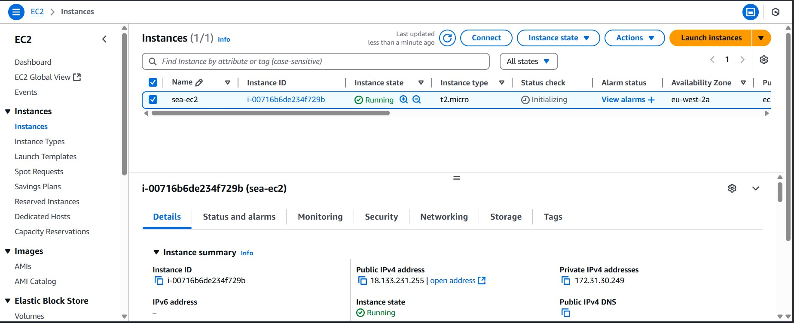
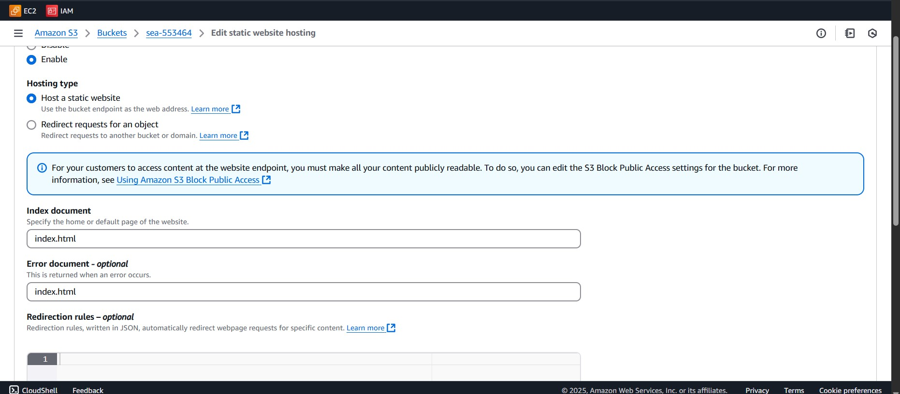

# 🌐 AWS Web Hosting Project with EC2, NGINX, Elastic IP, and S3

This project demonstrates the deployment of a web server and static website using AWS services. It includes launching an Ubuntu EC2 instance, installing NGINX, configuring an Elastic IP, and hosting a static webpage via Amazon S3.

---

## ✅ Project Overview

**Services Used:**
- Amazon EC2 (Ubuntu)
- NGINX Web Server
- Elastic IP
- Amazon S3 (Static Website Hosting)

---

## 🛠️ Setup Steps

### 1. Launch an Ubuntu EC2 Instance

An EC2 instance was launched using the Ubuntu Server 20.04 LTS AMI:

- Chose instance type: `t2.micro` (Free Tier eligible)
- Configured a security group to allow **HTTP (80)**, **HTTPS (443)**, and **SSH (22)** access
- Launched instance with a key pair for SSH access

 

---

### 2. Connect to the EC2 Instance via SSH

Used the key pair to securely SSH into the instance:

```bash
ssh -i "my-key.pem" ubuntu@<EC2-Public-IP>

```

### 3.  Install and Start NGINX
Once inside the instance, NGINX was installed and configured:

```bash
sudo apt update
sudo apt install nginx -y
sudo systemctl start nginx
sudo systemctl enable nginx
```
 


NGINX was then confirmed to be running by accessing the public IP via browser.

### 4. Allocate and Attach an Elastic IP
An Elastic IP address was allocated and associated with the EC2 instance to ensure consistent public access.

Steps:

Go to EC2 > Elastic IPs > Allocate Elastic IP

Associate the IP with the running EC2 instance

### 5. Create and Configure S3 Bucket for Static Hosting
An S3 bucket was created to host a static HTML file.

Steps:

Created a new bucket with public access enabled

Uploaded index.html

Enabled static website hosting under Properties

 


### 6. Access the Static Webpage
Visited the S3 static site via its public endpoint:

```
http://<your-bucket-name>.s3-website-<region>.amazonaws.com/
```
 


### 📦 Final Outcome
✅ EC2 instance running NGINX accessible via a stable Elastic IP

✅ Static website hosted and publicly available on Amazon S3