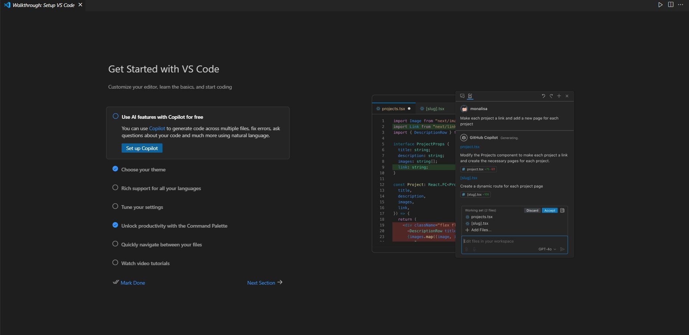
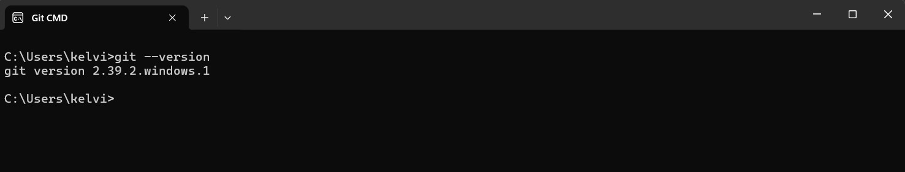
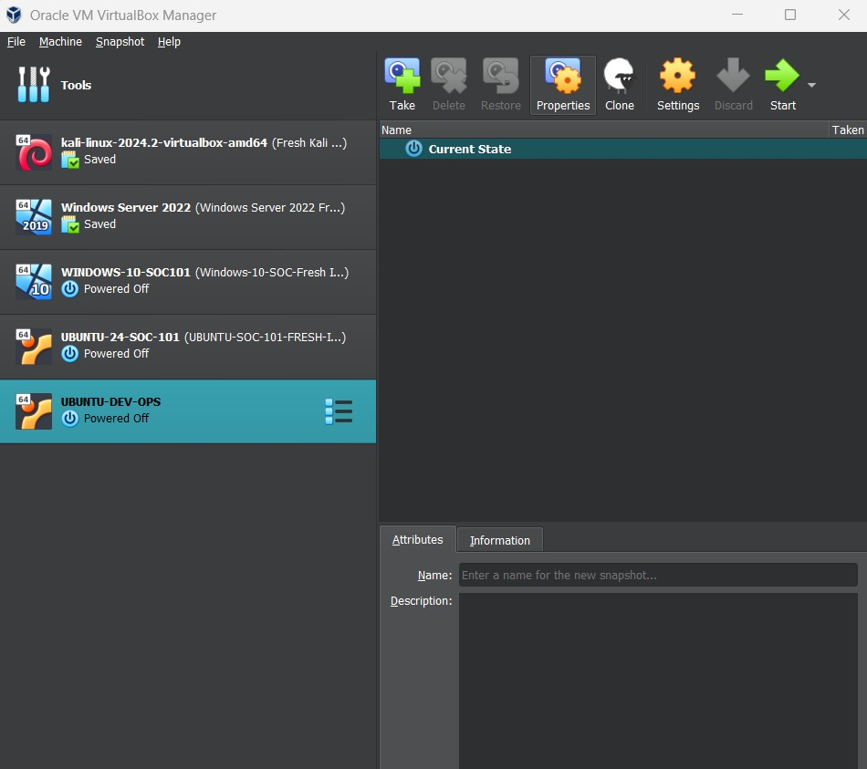
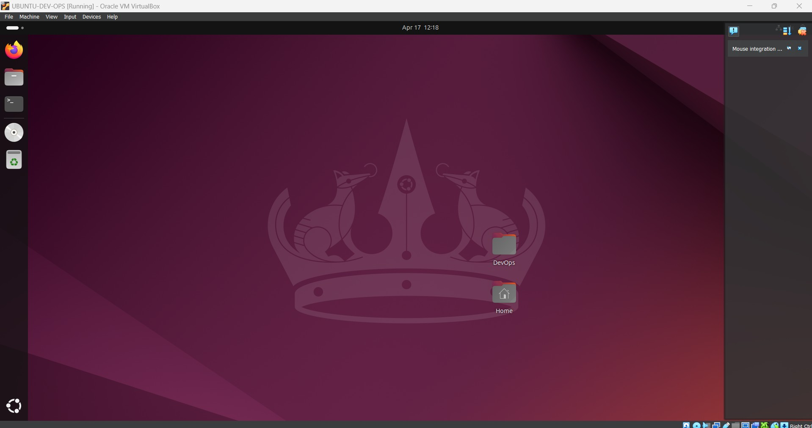
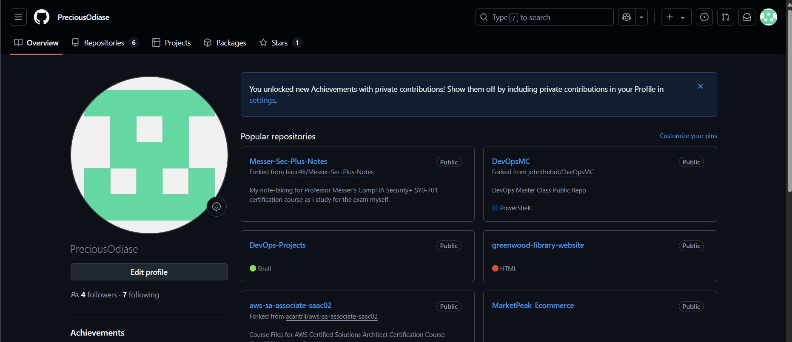
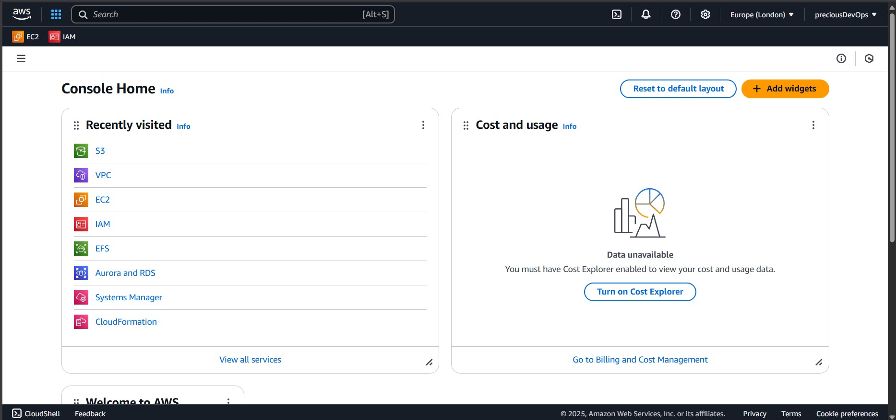

# Tech Environment Setup for Windows Users 

## Welcome! 
This project aims to provide a step-by-step guide for setting up a complete tech development environment. By following this guide, users will install essential tools, create necessary accounts, and configure their environment to support software development, cloud computing, and virtualization effectively. Let's dive in!

---

## 🔹 1. Installing Visual Studio Code (VSCode)

### Steps to Install VSCode
1. **Download VSCode:**
   - Head over to [VSCode Official Website](https://code.visualstudio.com/).
   - Click **Download** for Windows.

2. **Install VSCode:**
   - Open the downloaded `.exe` file.
   - Follow the installation wizard and **keep all default settings**.
   - Click **Finish** when done.

3. **Launch VSCode:**
   - Open **Start Menu** and search for `Visual Studio Code`.
   - Click to launch.

4. **Verify Installation:**
   - Open VSCode and navigate to **Help > About** to check the version.



### 🛠 Troubleshooting
- **VSCode won’t open?** Try running it as Administrator.
- **Extensions not working?** Restart VSCode or ensure your internet connection is stable.

---

## 🔹 2. Installing Git

### Steps to Install Git on Windows
1. **Download Git:**
   - Visit [Git Official Website](https://git-scm.com/downloads/).
   - Click **Download for Windows** and install.

2. **Verify Installation:**
   - Open **Command Prompt** (`cmd`) and run:
     ```sh
     git --version
     ```

3. **Configure Git:**
   ```sh
   git config --global user.name "Your Name"
   git config --global user.email "your.email@example.com"
   ```

### 🛠 Troubleshooting
- **Git command not found?** Restart your computer and try again.



---

## 🔹 3. Installing VirtualBox for Windows

### Steps to Install VirtualBox
1. **Download VirtualBox:**
   - Visit [VirtualBox Official Website](https://www.virtualbox.org/).
   - Download the **Windows version**.

2. **Install VirtualBox:**
   - Open the `.exe` file and follow the on-screen instructions.
   - Keep default settings and complete the installation.

3. **Verify Installation:**
   - Open **Command Prompt** and run:
     ```sh
     VBoxManage --version
     ```

### 🛠 Troubleshooting
- **VirtualBox won’t install?** Run the installer as Administrator.
- **VM not starting?** Ensure **virtualization** is enabled in BIOS.


---

## 🔹 4. Installing Ubuntu on VirtualBox

### Steps to Install Ubuntu
1. **Download Ubuntu ISO:**
   - Visit [Ubuntu Official Website](https://ubuntu.com/download/desktop) and download the latest version.

2. **Create a Virtual Machine in VirtualBox:**
   - Open VirtualBox and click **New**.
   - Enter a name (e.g., "Ubuntu"), select **Linux**, and choose **Ubuntu (64-bit)**.
   - Allocate at least **4GB RAM** and **20GB storage**.

3. **Attach Ubuntu ISO:**
   - Go to **Settings > Storage**.
   - Click **Empty** under **Controller: IDE**, then click the **CD icon** to choose a disk file.
   - Select the downloaded Ubuntu ISO.

4. **Start the Virtual Machine:**
   - Click **Start** and follow the on-screen Ubuntu installation instructions.

### 🛠 Troubleshooting
- **VM won’t boot?** Enable **virtualization** in your BIOS settings.


---

## 🔹 5. Creating a GitHub Account

### Steps to Create a GitHub Account
1. Visit [GitHub](https://github.com/).
2. Click **Sign Up**.
3. Enter your details and complete the setup.



## 🔹 6. Creating an AWS Account

### Steps to Create an AWS Account
1. Visit [AWS Official Site](https://aws.amazon.com/).
2. Click **Create an AWS Account**.
3. Follow the sign-up steps and verify your email.
4. **Payment Information:** AWS requires a valid credit/debit card for verification.
5. **Sign in to AWS Console.**

### 🛠 Troubleshooting
- **Payment verification failed?** Ensure your card supports international transactions.



---

